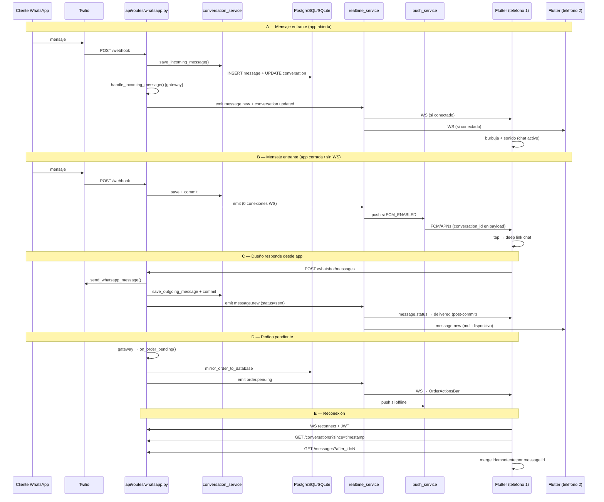

## v1.9


###########################################################
## v1.0.
Primer versión


###########################################################
## v1.1


## prompt ##


Aquí tienes un **prompt listo para copiar y pegar** en Cursor. Está alineado con tu repo actual (`final_system/`, FastAPI, Flutter `whatsbot_app`, polling 4s/8s, notificaciones locales sin FCM).

---

```
@PROMPT_EVOLUCION_SAAS_WHATSBOT.md
@README.md
@docs/FLUTTER_APP.md
@docs/ARCHITECTURE.md

# FASE 11 — WhatsBot tiempo real (paridad lógica con WhatsApp)

## Objetivo

La UI de WhatsBot ya imita WhatsApp. Ahora implementa la **lógica en tiempo real** equivalente: sin polling como mecanismo principal, con entrega instantánea de mensajes, notificaciones push reales, reconexión, estados de mensaje y comportamiento de app en foreground/background como WhatsApp.

**No reescribas el chatbot ni la UI desde cero.** Cambio incremental sobre lo existente.

---

## Estado actual (no romper)

| Componente | Hoy |
|------------|-----|
| Backend | FastAPI `python -m api.main`, REST en `/whatsbot/*`, webhook Twilio `POST /webhook` |
| Persistencia | PostgreSQL prod / SQLite dev — fuente de verdad |
| Flutter | `chat_screen.dart` polling 4s, `chats_list_screen.dart` polling 8s |
| Alertas | `MessageAlertsService` con `flutter_local_notifications` + sonido local (NO FCM/APNs) |
| Sesión móvil | `SharedPreferences` (JWT, business_id) |
| Gateway bot | `chatbot/gateway.py` → `handle_incoming_message()` — INTOCABLE en lógica de negocio |

**Problema:** polling no escala, no es instantáneo, gasta batería/datos, no se comporta como WhatsApp con app cerrada o en background.

---

## Meta de producto (paridad UX con WhatsApp)

Comportamientos que DEBEN quedar implementados (equivalente funcional, no clonar protocolo propietario de Meta):

### A. Tiempo real en app abierta
- [ ] **WebSocket** (preferido) o **SSE** desde FastAPI hacia Flutter, autenticado con JWT
- [ ] Al guardar mensaje entrante/saliente en BD → **emitir evento inmediato** al dueño conectado
- [ ] Lista de chats se actualiza al instante (nuevo mensaje, preview, timestamp, orden)
- [ ] Chat abierto recibe burbujas nuevas sin esperar timer
- [ ] **Eliminar polling** como mecanismo principal (`chatPollInterval`, `chatsRefreshInterval`); solo fallback de reconexión si WS cae

### B. App en background / cerrada (push real)
- [ ] **Firebase Cloud Messaging (Android)** + **APNs vía Firebase (iOS)**
- [ ] Registrar `device_token` por negocio/usuario al login; endpoint backend para guardar/actualizar token
- [ ] Cuando llega mensaje de cliente (webhook Twilio → `save_incoming_message`) y el dueño NO tiene WS activo → **enviar push FCM/APNs**
- [ ] Tap en notificación → abrir conversación correcta (deep link / payload `conversation_id`)
- [ ] Mantener notificaciones locales solo como fallback si FCM no está configurado

### C. Estados de mensaje (estilo WhatsApp)
- [ ] **Enviando** → **Enviado al servidor** → **Entregado** (guardado en BD / emitido por WS) → **Leído** (dueño abrió chat / marcó visto)
- [ ] Campos en BD si faltan (`status`, `delivered_at`, `read_at`) + eventos WS
- [ ] Checks dobles en mensajes salientes del dueño; ticks grises/azules en UI Flutter

### D. Presencia y actividad
- [ ] **Online / last seen** del dueño (opcional v1: solo “conectado ahora” vía heartbeat WS)
- [ ] **Typing indicator** cuando el dueño escribe (emitir evento WS; mostrar “escribiendo…” en chat — preparar hook aunque el cliente WhatsApp no escriba desde la app del dueño)

### E. Resiliencia (como apps de mensajería)
- [ ] Reconexión automática WS con backoff exponencial
- [ ] **Sync al reconectar:** `GET /whatsbot/conversations?since=` y mensajes `?after_id=` para no perder nada
- [ ] Idempotencia de eventos (no duplicar burbujas ni notificaciones)
- [ ] Multidispositivo: mismo negocio logueado en 2 teléfonos recibe eventos en ambos

### F. Pedidos en tiempo real
- [ ] Evento WS + push cuando hay pedido pendiente nuevo
- [ ] Barra Aprobar/Rechazar se actualiza sin polling

---

## Reglas absolutas

1. **Cero regresión** del chatbot Twilio y flujos de pedido/admin legacy
2. **No tocar** algoritmos de `chatbot/app/core/*` ni intents
3. Gateway sigue siendo `handle_incoming_message()` — solo engancha eventos DESPUÉS de persistir en BD
4. REST existente sigue funcionando (Flutter puede usar REST para historial inicial + WS para live)
5. Sin UI web — solo Flutter + API
6. Secrets FCM en `.env` del servidor, **nunca** en la app Flutter
7. Cambios incrementales por subfases; al cerrar cada subfase: nota en `docs/INCREMENTAL_GUIDE.md`
8. Tests nuevos + actualizar `scripts/validate_system.py` donde aplique

---

## Arquitectura propuesta

```
Cliente WhatsApp → Twilio → POST /webhook
                              ↓
                    save_incoming_message (PostgreSQL)
                              ↓
              ┌───────────────┴────────────────┐
              ↼                                ▼
    WebSocket hub (dueño conectado)     FCM/APNs (dueño offline)
              ↓                                ↓
         Flutter WhatsBot                  Flutter WhatsBot
    (actualiza UI al instante)         (notificación + abrir chat)
```

### Backend (FastAPI)
- Nuevo módulo ej. `api/routes/realtime.py` o `services/realtime_service.py`
- Endpoint: `WS /whatsbot/ws` (JWT en query o primer frame auth)
- Tipos de evento JSON mínimos:
  - `message.new`, `message.status`, `conversation.updated`
  - `order.pending`, `order.updated`
  - `typing.start`, `typing.stop` (opcional fase 3)
  - `ping` / `pong`
- Emitir desde:
  - `api/routes/whatsapp.py` (incoming/outgoing bot)
  - `api/routes/whatsbot.py` (mensaje del dueño, approve/reject pedido)
- Tabla `device_tokens(business_id, token, platform, updated_at)`
- Servicio push: Firebase Admin SDK en Python (`firebase-admin`) leyendo credenciales desde env

### Flutter
- Nuevo `RealtimeService` (WebSocket + stream)
- Integrar en `chat_screen`, `chats_list_screen`, `MessageAlertsService`
- Firebase Messaging: `firebase_core`, `firebase_messaging`
- Eliminar `Timer.periodic` de polling salvo fallback temporal documentado
- UI: ticks de estado, badge no leídos, “escribiendo…”

### Variables `.env` nuevas (documentar en `.env.example`)
- `FCM_ENABLED=true|false`
- `FCM_SERVICE_ACCOUNT_JSON` o path a JSON
- `REALTIME_ENABLED=true` (feature flag)
- `WS_HEARTBEAT_SECONDS=30`

---

## Plan incremental (ejecutar EN ORDEN, un chat por subfase)

### Subfase 11.1 — Análisis (SIN código)
Entregables:
- Mapa de archivos a tocar
- Diagrama de eventos
- Decisión WS vs SSE (justificar)
- Plan migración polling → realtime sin downtime

Espera mi "Sí" antes de 11.2.

### Subfase 11.2 — Backend WebSocket + eventos BD
- WS autenticado
- Hub por `business_id`
- Emitir `message.new` al guardar mensajes
- Tests API/WS
- REST `?since=` / `?after_id=` si no existen

### Subfase 11.3 — Flutter WebSocket + quitar polling
- Conectar al abrir app post-login
- Actualizar lista y chat en vivo
- Reconexión + sync
- Eliminar timers de polling

### Subfase 11.4 — Push FCM/APNs
- Registro token en login
- Push cuando WS no conectado
- Deep link a conversación
- Guía setup Firebase en `docs/FLUTTER_APP.md`

### Subfase 11.5 — Estados mensaje + ticks UI + pedidos live
- delivered/read
- Ticks en burbujas
- Eventos pedido pendiente

### Subfase 11.6 — Validación E2E
- Checklist manual WhatsApp-like
- `validate_system.py` ampliado
- `flutter analyze` sin issues
- Actualizar README sección tiempo real

---

## Checklist E2E (debe pasar al cerrar Fase 11)

- [ ] Cliente escribe por WhatsApp → dueño ve mensaje en app **< 1 s** con app abierta (sin polling)
- [ ] App en background → push FCM/APNs → tap abre el chat correcto
- [ ] Dueño responde → cliente recibe por Twilio (sin regresión)
- [ ] App cerrada → push llega
- [ ] Reconexión WiFi → no se pierden mensajes
- [ ] Dos teléfonos mismo negocio → ambos reciben eventos
- [ ] Pedido nuevo → notificación + barra approve sin refrescar manual
- [ ] Sin FCM configurado → WS sigue funcionando; degradación documentada
- [ ] Producción Railway: WS + Postgres + FCM operativos

---

## Instrucción inicial

Empieza **solo Subfase 11.1 (análisis, sin modificar código)**.

Contexto: hoy polling 4s/8s en Flutter; notificaciones locales; backend sin WebSocket. Queremos paridad lógica con WhatsApp (tiempo real + push + estados + reconexión).

Entrega el mapa de archivos, diagrama de eventos, decisión WS vs SSE, y plan de subfases 11.2–11.6.

¿Procedo con 11.2? (espera mi Sí)
```

---

**Nota honesta (para ti, no para el prompt):** no vas a clonar el protocolo interno de WhatsApp (MQTT/XMPP propietario). Este prompt pide **el mismo comportamiento percibido**: instantáneo, push con app cerrada, ticks, reconexión. Eso sí es alcanzable con WS + FCM.

Si quieres, en otro mensaje te armo también la versión **corta** (un solo bloque para pegar fase por fase como `PROMPTS_LISTOS.md`).


## resp cursor ##


# Fase 11.1 — Análisis (sin código)

Análisis del repo actual frente al objetivo de paridad lógica con WhatsApp. **No se ha modificado ningún archivo.**

---

## 1. Estado actual confirmado

| Área | Hallazgo en repo |
|------|------------------|
| **Polling Flutter** | `chat_screen.dart` → `Timer.periodic(4s)`; `chats_list_screen.dart` → `8s` (`api_config.dart`) |
| **Alertas** | `message_alerts_service.dart` — locales + sonido; depende del polling para detectar mensajes |
| **Backend realtime** | No hay WebSocket, SSE ni FCM |
| **Persistencia mensajes** | `save_incoming_message` / `save_outgoing_message` en `conversation_service.py`; sin hooks post-commit |
| **Modelo Message** | Sin `status`, `delivered_at`, `read_at` |
| **REST incremental** | `GET /whatsbot/conversations` y `.../messages` sin `?since=` ni `?after_id=` |
| **Pedidos live** | `on_order_pending()` en `notification_service.py` → admin legacy + `mirror_order_to_database`; Flutter hace polling de `/orders/pending` |
| **Auth** | JWT con `business_id` en `api/middleware/auth.py` — reutilizable para WS |
| **Gateway** | `chatbot/gateway.py` → `handle_incoming_message()` — **no tocar lógica**; solo enganchar eventos después de `db.commit()` |

---

## 2. Mapa de archivos a tocar

### Backend — nuevos

| Archivo | Rol |
|---------|-----|
| `services/realtime_service.py` | Hub in-memory por `business_id`; broadcast; tracking conexiones activas |
| `api/routes/realtime.py` | `WS /whatsbot/ws`; auth JWT; ping/pong |
| `services/push_service.py` | Firebase Admin SDK; envío FCM/APNs si dueño offline |
| `models/device_token.py` | Tabla `device_tokens` |
| `services/device_token_service.py` | CRUD tokens por negocio/plataforma |
| `api/schemas_realtime.py` (o ampliar `schemas.py`) | Payloads de eventos WS + registro token |
| `tests/test_realtime_ws.py` | WS auth, `message.new`, multidispositivo |
| `tests/test_push_service.py` | Push mock (sin FCM real en CI) |

### Backend — modificar (hooks mínimos)

| Archivo | Cambio |
|---------|--------|
| `api/main.py` | Registrar router realtime; lifespan opcional init FCM |
| `api/routes/whatsapp.py` | Tras `db.commit()` en incoming/outgoing → `emit_message_new()` |
| `api/routes/whatsbot.py` | Tras envío dueño; approve/reject; endpoint `POST /whatsbot/device-token`; `?since=` / `?after_id=` |
| `services/conversation_service.py` | Filtros `since` / `after_id`; `mark_read`; estados mensaje |
| `services/notification_service.py` | Tras `mirror_order_to_database` → `emit_order_pending()` + push |
| `models/message.py` | `status`, `delivered_at`, `read_at` |
| `api/schemas.py` | Campos nuevos en `MessageOut` |
| `scripts/migrate_db.py` | Migración columnas + tabla `device_tokens` |
| `config/settings.py` | `REALTIME_ENABLED`, `FCM_ENABLED`, `WS_HEARTBEAT_SECONDS`, credenciales FCM |
| `.env.example` | Variables Fase 11 |
| `requirements.txt` | `firebase-admin` |

### Flutter — nuevos

| Archivo | Rol |
|---------|-----|
| `lib/services/realtime_service.dart` | WebSocket, stream de eventos, reconexión backoff |
| `lib/services/push_service.dart` | `firebase_messaging`; registro token; deep link |
| `lib/models/realtime_event.dart` | Tipos de evento |
| `lib/widgets/message_status_ticks.dart` | Checks grises/azules |
| `lib/widgets/typing_indicator.dart` | “escribiendo…” (v1 opcional) |

### Flutter — modificar

| Archivo | Cambio |
|---------|--------|
| `lib/config/api_config.dart` | URL WS; quitar o marcar deprecated intervals de polling |
| `lib/services/api_client.dart` | `since`/`after_id`; `registerDeviceToken`; `markMessagesRead` |
| `lib/models/message.dart` | `status`, `deliveredAt`, `readAt` |
| `lib/screens/chat_screen.dart` | Suscribirse a stream; quitar timer; typing emit; ticks |
| `lib/screens/chats_list_screen.dart` | Stream `conversation.updated`; quitar timer |
| `lib/services/message_alerts_service.dart` | Eventos WS en foreground; FCM en background; local como fallback |
| `lib/main.dart` | Init Firebase + `RealtimeService` post-login |
| `lib/widgets/message_bubble.dart` | Hora + ticks en salientes |
| `pubspec.yaml` | `firebase_core`, `firebase_messaging`, `web_socket_channel` |
| `android/` + `ios/` | Config Firebase (google-services.json, GoogleService-Info.plist) |

### Docs / validación

| Archivo | Cambio |
|---------|--------|
| `docs/INCREMENTAL_GUIDE.md` | Notas 11.2–11.6 |
| `docs/FLUTTER_APP.md` | Setup Firebase, WS, degradación sin FCM |
| `docs/ARCHITECTURE.md` | Diagrama realtime |
| `README.md` | Sección tiempo real |
| `scripts/validate_system.py` | Checks WS + sync incremental |

### Intocable (solo lectura / enganche post-persist)

| Archivo | Regla |
|---------|-------|
| `chatbot/gateway.py` | Sin cambios de lógica |
| `chatbot/app/core/*` | Sin tocar intents/flow |
| `chatbot/app/services/admin_service.py` | Legacy admin intacto |

---

## 3. Diagrama de eventos



### Catálogo de eventos WS (JSON)

| `type` | Cuándo | Payload mínimo |
|--------|--------|----------------|
| `message.new` | Tras commit incoming/outgoing | `message`, `conversation` |
| `message.status` | delivered / read | `message_id`, `status`, `at` |
| `conversation.updated` | Preview/timestamp cambia | `conversation_id`, `preview`, `last_message_at` |
| `order.pending` | `mirror_order_to_database` | `order` |
| `order.updated` | approve/reject | `order_id`, `status` |
| `typing.start` / `typing.stop` | Dueño escribe (v1) | `conversation_id`, `business_id` |
| `presence.online` | Heartbeat WS | `business_id`, `at` |
| `ping` / `pong` | Keepalive | — |

---

## 4. Decisión: WebSocket vs SSE

### Recomendación: **WebSocket**

| Criterio | WebSocket | SSE |
|----------|-----------|-----|
| **Bidireccional** | Nativo (typing, read receipts, ping) | Solo servidor→cliente; typing requiere REST extra |
| **Flutter** | `web_socket_channel` maduro | Menos idiomático; reconexión manual |
| **FastAPI** | `WebSocket` nativo en Starlette | `StreamingResponse` funciona pero sin frames cliente |
| **Multidispositivo** | Mismo hub, N conexiones por `business_id` | Igual, pero sin canal cliente→servidor |
| **Batería/datos** | Un socket persistente; heartbeat 30s | Reconexión HTTP larga; proxies pueden cortar |
| **Railway / ngrok** | Soportado con upgrade; documentar sticky sessions | Más frágil con timeouts de proxy |
| **Estados mensaje** | `message.status` en ambos sentidos | Marcar leído = POST adicional (aceptable pero peor UX dev) |

**SSE solo tendría sentido** si se quisiera evitar WS en infraestructura muy restrictiva. En este proyecto (FastAPI + Flutter + typing + presence + heartbeat) **WS es la opción correcta**.

**Nota producción (Railway):** el hub in-memory funciona en **una instancia**. Si escalas a N réplicas, hará falta `REDIS_URL` (ya en `.env.example`) como pub/sub entre workers — planificar en 11.2 como extensión, no bloqueante para MVP single-instance.

---

## 5. Plan de migración polling → realtime (sin downtime)

### Principio: feature flag + degradación gradual

```
REALTIME_ENABLED=true|false  (backend)
USE_REALTIME=true|false      (Flutter, compile-time o remoto vía /health)
```

### Fases de rollout

| Paso | Comportamiento |
|------|----------------|
| **11.2** | Backend emite eventos; REST sin cambios; polling sigue en Flutter |
| **11.3** | Flutter conecta WS; **dual mode**: WS primario + polling fallback cada 30–60s si WS caído |
| **11.4** | FCM para background; polling fallback solo si `WS down && !FCM` |
| **11.5** | Estados + ticks; quitar polling de chat/lista cuando WS estable |
| **11.6** | `REALTIME_ENABLED` on por defecto; polling eliminado salvo reconexión documentada |

### Idempotencia (evitar duplicados)

- Flutter mantiene `Set<int> _knownMessageIds` por conversación.
- Eventos WS con `message.id`; ignorar si `id <= maxKnown`.
- `MessageAlertsService._notifiedMessageIds` se reutiliza para push/WS.
- Sync post-reconexión: `after_id=maxKnown` — merge sin duplicar burbujas.

### Reconexión

```
backoff: 1s → 2s → 4s → 8s → 30s (cap)
on open: GET conversations?since=lastSyncAt
         GET messages?after_id=lastId (chat activo)
heartbeat: ping cada WS_HEARTBEAT_SECONDS (30)
```

### Puntos de enganche (sin tocar gateway)

```python
# Patrón en whatsapp.py / whatsbot.py — DESPUÉS de db.commit()
if settings.REALTIME_ENABLED:
    await realtime_service.emit_to_business(business_id, event)
    if not realtime_service.has_active_connection(business_id):
        await push_service.maybe_notify(business_id, event)
```

`conversation_service` **no** debe importar realtime (evitar acoplamiento); los routes son el único punto de emisión.

---

## 6. Plan detallado subfases 11.2–11.6

### 11.2 — Backend WebSocket + eventos BD

- `RealtimeHub`: `dict[business_id, set[WebSocket]]`
- Auth: JWT en query `?token=` (estándar móvil) o primer frame `{"type":"auth","token":"..."}`
- Hooks en `whatsapp.py` (líneas ~88, ~122) y `whatsbot.py` (`send_owner_message`)
- REST incremental:
  - `GET /whatsbot/conversations?since=ISO8601`
  - `GET /whatsbot/conversations/{id}/messages?after_id=N`
- Tests: conexión, auth inválida, broadcast 2 clientes mismo `business_id`
- **Entregable:** nota en `INCREMENTAL_GUIDE.md`

### 11.3 — Flutter WebSocket + reducir polling

- `RealtimeService` singleton; conectar en `ChatsListScreen.initState` post-login
- `chat_screen`: listener `message.new` filtrado por `conversation_id`
- `chats_list_screen`: listener `conversation.updated` → reorder lista
- Fallback: timer 30s solo si `!realtime.isConnected`
- `api_client`: métodos sync incremental
- **Entregable:** mensaje cliente visible &lt;1s con app abierta (manual)

### 11.4 — Push FCM/APNs

- Tabla `device_tokens`; `POST /whatsbot/device-token`
- `firebase-admin` en servidor; secrets en `.env`
- Flutter: `firebase_core` + `firebase_messaging`; registrar token en login
- Payload: `{type, conversation_id, preview}`; tap → `navigatorKey` + `ChatScreen`
- `MessageAlertsService`: FCM foreground handler; locales si `!FCM_ENABLED`
- Guía Firebase en `docs/FLUTTER_APP.md`
- **Entregable:** push con app en background (manual)

### 11.5 — Estados mensaje + ticks + pedidos live

- Migración BD: `status` (`sending|sent|delivered|read`), timestamps
- Dueño abre chat → `POST .../mark-read` o evento WS `read`
- `message_bubble.dart`: ✓ gris (sent/delivered), ✓✓ azul (read)
- `order.pending` / `order.updated` en WS; quitar polling `/orders/pending` en chat
- Typing v1: emitir en `TextField.onChanged` (debounce 300ms)
- **Entregable:** ticks visibles; barra pedido sin refresh manual

### 11.6 — Validación E2E

- Checklist manual (del prompt)
- `validate_system.py`: WS connect + `message.new` tras webhook simulado
- `pytest` ampliado; `flutter analyze` limpio
- README sección “Tiempo real”
- Polling eliminado de `api_config.dart` (o documentado como emergency fallback)

---

## 7. Riesgos y mitigaciones

| Riesgo | Mitigación |
|--------|------------|
| WS cortado por proxy/ngrok free | Documentar URL estable; heartbeat; fallback sync REST |
| Multi-instancia Railway sin Redis | MVP single worker; flag `REDIS_URL` para pub/sub en 11.2+ |
| FCM no configurado en dev | `FCM_ENABLED=false`; WS + notificaciones locales |
| Regresión webhook Twilio | Tests existentes + `validate_chatbot.py` en cada subfase |
| JWT expira con WS largo | Reauth en reconexión; token refresh opcional v2 |
| Duplicados WS + polling dual | Idempotencia por `message.id`; quitar polling en 11.5 |

---

## 8. Dependencias nuevas previstas

**Python:** `firebase-admin`  
**Flutter:** `firebase_core`, `firebase_messaging`, `web_socket_channel`

**`.env` nuevas:**
```env
REALTIME_ENABLED=true
FCM_ENABLED=false
FCM_SERVICE_ACCOUNT_JSON_PATH=credentials/firebase-service-account.json
WS_HEARTBEAT_SECONDS=30
```

---

## Resumen ejecutivo

El repo está listo para un cambio **incremental**: los puntos de persistencia ya existen (`conversation_service` + routes); falta la capa de distribución (WS hub + FCM) y la suscripción en Flutter. WebSocket gana sobre SSE por bidireccionalidad (typing, read, heartbeat) y mejor encaje con FastAPI/Flutter. La migración puede hacerse con feature flags, dual mode temporal y sync `since`/`after_id` en reconexión, sin tocar `chatbot/gateway.py`.

---

**¿Procedo con la Subfase 11.2 (Backend WebSocket + eventos BD)?** Responde **Sí** cuando quieras que empiece a implementar.


## segundo prompt ##

si


## resp cursor ##

**Subfase 11.2 completada.** Backend WebSocket operativo; 23 tests pasan; gateway intacto.

## Qué se implementó

### Hub realtime
- `services/realtime_service.py` — hub in-memory por `business_id`, broadcast multidispositivo
- Eventos: `message.new`, `conversation.updated`, `connected`, `ping`/`pong`

### WebSocket autenticado
- `WS /whatsbot/ws?token=<JWT>` en `api/routes/realtime.py`
- Mismo JWT que REST (`business_id` en el claim)
- Heartbeat servidor cada `WS_HEARTBEAT_SECONDS` (default 30s)

### Emisión tras persistir en BD
- `api/routes/whatsapp.py` — incoming del cliente + outgoing del bot (después de `commit`)
- `api/routes/whatsbot.py` — mensaje del dueño desde la app

### REST incremental (sync al reconectar)
- `GET /whatsbot/conversations?since=ISO8601`
- `GET /whatsbot/conversations/{id}/messages?after_id=N`

### Config
- `REALTIME_ENABLED=true` (por defecto)
- `WS_HEARTBEAT_SECONDS=30`
- `/health` incluye `realtime_enabled`

### Tests
- `tests/test_realtime_ws.py` — 8 tests: auth, pong, `message.new`, multidispositivo, webhook, filtros `since`/`after_id`

---

## Probar manualmente

1. Login → copiar `access_token`
2. Conectar con cualquier cliente WS:
   ```
   wss://{API_PUBLIC_URL}/whatsbot/ws?token={JWT}
   ```
3. Recibirás `{"type":"connected",...}`
4. Enviar mensaje al bot por WhatsApp → llega `message.new` al instante

---

## Siguiente paso: 11.3

Flutter `RealtimeService`, suscripción en lista/chat, reconexión con sync, y reducir polling.

¿Procedo con **11.3**?


##############################################3
## v1.2

## prompt ##

Sí


## Resp cursor ##


**Subfase 11.3 completada.** La app Flutter usa WebSocket en tiempo real; `flutter analyze` sin issues.

## Cambios principales

### Nuevo `RealtimeService`
- Conecta a `wss://{API}/whatsbot/ws?token=JWT` tras login o restaurar sesión
- Reconexión automática con backoff (1s → 2s → 4s → … → 30s)
- Responde `ping` del servidor con `pong`
- Al reconectar: sync REST con `?since=` para conversaciones perdidas

### Pantallas actualizadas
- **Lista de chats** — escucha `message.new` y `conversation.updated`; reordena al instante
- **Chat** — burbujas nuevas vía WS; idempotencia por `message.id`
- **Polling eliminado** (4s/8s) → fallback REST cada **30s** solo si el WS está caído (icono nube en AppBar)

### Otros
- Alertas desde eventos WS (`handleRealtimeMessage`)
- Logout desconecta el WS
- `api_client`: `accessToken`, `getConversations(since:)`, `getMessages(afterId:)`

---

## Cómo probar

1. Reinicia la app (`flutter run` de nuevo — hot reload no basta para el nuevo servicio)
2. Backend con `REALTIME_ENABLED=true`
3. Login → deja la lista de chats abierta
4. Envía un WhatsApp al bot → el chat debe aparecer/actualizarse al instante (sin esperar 4s)

Si ves el icono de nube en el AppBar, el WS no está conectado y entra el fallback REST de 30s.

---

## Pendiente (11.4+)

- Push FCM con app en background/cerrada
- Ticks de estado (✓ / ✓✓)
- Pedidos live sin polling REST

¿Procedo con **11.4 (FCM/APNs)**?


###########################################################
## v1.3

## prompt ##

Sí


## Resp cursor ##

**Subfase 11.4 completada.** Push FCM/APNs en backend y Flutter; 27 tests pasan; `flutter analyze` limpio.

## Backend

| Componente | Detalle |
|------------|---------|
| `models/device_token.py` | Tabla `device_tokens` por negocio |
| `services/push_service.py` | Firebase Admin SDK; push solo si **no hay WS** y mensaje **entrante** |
| API | `POST /whatsbot/device-token`, `DELETE /whatsbot/device-token` |
| Config | `FCM_ENABLED`, `FCM_SERVICE_ACCOUNT_JSON_PATH` en `.env` |
| Hook | Tras `emit_message_saved` → `maybe_push_incoming_message` |

## Flutter

| Componente | Detalle |
|------------|---------|
| `lib/services/push_service.dart` | Registro token en login; tap en notificación → abre chat |
| Degradación | Sin `google-services.json` la app sigue con WS + notificaciones locales |
| Logout | Desregistra token en servidor |

## Configurar push (cuando quieras activarlo)

1. Firebase Console → apps Android + iOS  
2. `google-services.json` → `whatsbot_app/android/app/`  
3. `GoogleService-Info.plist` → `whatsbot_app/ios/Runner/`  
4. Clave de servicio JSON → `final_system/credentials/firebase-service-account.json`  
5. En `.env`:
   ```env
   FCM_ENABLED=true
   FCM_SERVICE_ACCOUNT_JSON_PATH=credentials/firebase-service-account.json
   ```
6. `python -m pip install -r requirements.txt` y reiniciar API  
7. Recompilar app: `flutter run`

Guía completa en `docs/FLUTTER_APP.md`.

## Flujo

```
Cliente escribe → webhook → BD → WS (si app abierta)
                              └→ FCM (si ningún WS conectado)
```

---

¿Procedo con **11.5** (estados de mensaje, ticks ✓/✓✓, pedidos live)?


#########################################################
## v1.4


## prompt ##

si


## resp cursor ##


**Subfase 11.5 completada.** 29 tests pasan; `flutter analyze` limpio.

## Backend

| Cambio | Detalle |
|--------|---------|
| **BD** | `messages.status`, `delivered_at`, `read_at` |
| **Migración** | `python scripts/migrate_message_status.py` (también en `migrate_db.py`) |
| **Estados** | Entrante → `delivered`; saliente dueño → `sent` → `delivered` tras WS |
| **Mark read** | `POST /whatsbot/conversations/{id}/mark-read` → incoming `read` + ticks azules en salientes del dueño |
| **WS** | `message.status`, `order.pending`, `order.updated`, `typing.start/stop` |
| **Pedidos** | Emitidos al crear pedido en BD y al aprobar/rechazar |

## Flutter

| Cambio | Detalle |
|--------|---------|
| **Ticks** | `message_status_ticks.dart` — ✓ gris (sent), ✓✓ gris (delivered), ✓✓ azul (read) |
| **Chat** | `mark-read` al abrir; escucha `message.status` y pedidos live |
| **Pedidos** | Barra Aprobar/Rechazar vía WS (sin polling REST en refresh) |
| **Typing** | Indicador “escribiendo…” vía WS al escribir en el input |

## Migración en tu entorno

Si ya tenías BD creada antes de esta fase:

```bash
cd final_system
python scripts/migrate_message_status.py
```

Luego reinicia API y recompila la app.

---

## Cómo probar

1. Dueño envía mensaje → ticks ✓✓ grises al instante  
2. Abre chat con mensajes entrantes → `mark-read` → entrantes marcados leídos  
3. Cliente hace pedido → barra amarilla aparece sin refrescar manual  
4. Escribir en el input → evento typing (visible en otro dispositivo conectado al mismo negocio)

---

¿Procedo con **11.6** (validación E2E, `validate_system.py`, README)?


##########################################################
## v1.5


## prompt ##

Sí


## resp cursor ##


**Fase 11 cerrada.** Subfase 11.6 completada; validación E2E en verde.

## 11.6 — Qué se hizo

### `validate_system.py` ampliado
Nueva sección **Realtime (Fase 11)**:
- `realtime_enabled` en `/health`
- `POST /whatsbot/device-token`
- WS connect + ping/pong
- `message.new` tras envío del dueño
- `POST mark-read` + `GET conversations?since=`
- Migración `migrate_message_status` en el setup

### Documentación
- **README.md** — sección tiempo real, variables `.env`, checklist Fase 11
- **ARCHITECTURE.md** — diagrama WS + FCM
- **INCREMENTAL_GUIDE.md** — nota 11.6, fase cerrada
- API versión **0.9.0**

### Validación ejecutada

| Check | Resultado |
|-------|-----------|
| `validate_system.py` | **0 fallos** |
| `validate_chatbot.py` | **0 fallos** |
| `pytest tests/` | **29 passed** |
| `flutter analyze` | **No issues** (de fases anteriores) |

---

## Resumen Fase 11 completa

| Subfase | Entregable |
|---------|------------|
| **11.1** | Análisis WS vs SSE, mapa de archivos |
| **11.2** | Backend WS + eventos BD + sync REST |
| **11.3** | Flutter `RealtimeService`, sin polling principal |
| **11.4** | Push FCM/APNs + device tokens |
| **11.5** | Estados mensaje, ticks, pedidos live, typing |
| **11.6** | E2E automatizado + docs |

---

## En tu entorno (si aún no lo hiciste)

```bash
cd final_system
python scripts/migrate_message_status.py
python -m api.main
# Otra terminal:
cd whatsbot_app && flutter run
```

Para push real: configura Firebase según `docs/FLUTTER_APP.md` y `FCM_ENABLED=true` en `.env`.

---

## Pendiente opcional (fuera de Fase 11)

- Redis pub/sub para múltiples instancias Railway
- Read receipts reales vía Twilio
- Typing desde el cliente WhatsApp (no solo el dueño en la app)

¿Quieres que arme el bloque corto en `README_PROMPTS.md` para futuras fases, o prefieres probar el flujo manual primero?


###########################################################
## v1.6


## prompt ##


¿Quieres que arme el bloque corto en README_PROMPTS.md para futuras fases, o prefieres probar el flujo manual primero?

No, actualiza prompts_listos que es donde se guarda todo eso, no toques readme_prompts, y aparte, sugiereme qué hacer ahora


## resp cursor ##


`PROMPTS_LISTOS.md` actualizado con la Fase 11 (prompts 12–17 marcados como hechos) y plantillas para Fase 12+ (prompts 18–22). `README_PROMPTS.md` no se tocó.

---

## Qué hacer ahora (orden recomendado)

### 1. Prueba manual en tu teléfono (30 min) — lo más urgente

Tienes `flutter run --release` activo. Valida el flujo real:

1. `python scripts/migrate_message_status.py` (si no lo corriste en tu BD de dev)
2. API con `REALTIME_ENABLED=true`
3. Login → cliente escribe al bot → mensaje **al instante** en la lista/chat
4. Respondes desde la app → cliente recibe por WhatsApp
5. Pedido de prueba → barra Aprobar/Rechazar sin refrescar

Si algo falla, anota qué pantalla y si ves el icono de nube (WS caído).

### 2. Firebase push (si quieres app cerrada/background)

Usa **Prompt 19** de `PROMPTS_LISTOS.md`. Sin Firebase, el sistema ya funciona con WS + notificaciones locales; push real es el único hueco de paridad con WhatsApp con app muerta.

### 3. Producción estable

Usa **Prompt 18** cuando quieras dejar de depender de ngrok en el PC:
- Railway/Render + PostgreSQL
- `API_PUBLIC_URL` HTTPS fija
- Webhook Twilio apuntando ahí
- `api_config.dart` con esa URL

### 4. Segundo negocio o cliente real

**Prompt 21** — `onboard_business.py` + nuevo número Twilio.

### 5. Solo si escalas a varias instancias API

**Prompt 20** (Redis) — no hace falta con un solo servidor.

---

## Mi sugerencia concreta

**Hoy:** prueba manual (paso 1). Es lo que confirma que los 29 tests automatizados se traducen en experiencia real en tu red/ngrok.

**Esta semana:** Firebase (paso 2) o deploy estable (paso 3), según lo que más te duela: ¿app cerrada sin avisos? → Firebase. ¿API se cae al apagar el PC? → deploy.

¿Quieres que te guíe paso a paso la prueba manual (qué mirar en logs si el WS no conecta) o el setup Firebase?


###########################################################
## v1.7

## prompt ##

No hagas nada, solo dime qué debo hacer ahora, las notificaciones funcionan com owhatsapp? por qué dices esto?

2. Firebase push (si quieres app cerrada/background)
Usa Prompt 19 de PROMPTS_LISTOS.md. Sin Firebase, el sistema ya funciona con WS + notificaciones locales; push real es el único hueco de paridad con WhatsApp con app muerta.

No hagas naa solo responde


## resp cursor ##

Sí: **ya está implementado en el código** (backend + Flutter). Lo que falta es **configurarlo en Firebase y en tu `.env`** — no hay que programar de nuevo la lógica push.

---

## Qué ya existe en el repo

| Parte | Qué hace |
|-------|----------|
| **Backend** | `push_service.py` — si `FCM_ENABLED=true` y no hay WebSocket activo, envía push al llegar un mensaje del cliente |
| **API** | `POST/DELETE /whatsbot/device-token` — la app registra el token al hacer login |
| **Flutter** | `push_service.dart` — pide token FCM, lo manda al servidor, tap en notificación abre el chat |
| **Docs** | `docs/FLUTTER_APP.md` sección **Push FCM/APNs** |

Por defecto está **apagado**: `FCM_ENABLED=false` en `.env.example`.

---

## Qué debes hacer tú (configuración, no código)

### 1. Firebase Console
- Crear proyecto en [console.firebase.google.com](https://console.firebase.google.com)
- Añadir app **Android** (`com.whatsbot.whatsbot_app`)
- Añadir app **iOS** (mismo bundle id que en Xcode)

### 2. Archivos en la app Flutter
- **Android:** descargar `google-services.json` → `whatsbot_app/android/app/google-services.json`
- **iOS:** descargar `GoogleService-Info.plist` → `whatsbot_app/ios/Runner/GoogleService-Info.plist`
- En Xcode: capability **Push Notifications** (en iOS)

### 3. Clave de servicio para el servidor
- Firebase → Configuración del proyecto → Cuentas de servicio → Generar clave JSON
- Guardar en algo como `final_system/credentials/firebase-service-account.json` (está en gitignore)

### 4. `.env` del backend (`final_system/.env`)
```env
FCM_ENABLED=true
FCM_SERVICE_ACCOUNT_JSON_PATH=credentials/firebase-service-account.json
```

### 5. Dependencias y rebuild
```bash
pip install -r requirements.txt   # firebase-admin
cd whatsbot_app && flutter pub get && flutter run   # recompilar app
```

### 6. iOS extra (solo si usas iPhone)
- Subir clave APNs en Firebase (Cloud Messaging)
- Certificado/provisioning con push habilitado

---

## Cómo comprobar que funciona

1. Login en la app (registra el token en el servidor)
2. **Cierra la app por completo** (no solo minimizar)
3. Cliente escribe al bot por WhatsApp
4. Debe llegar notificación del **sistema** (no solo sonido interno de la app)
5. Tap → abre el chat correcto

---

## Si no pones los archivos de Firebase

La app **no rompe**: `PushService.init()` falla en silencio y sigues con WebSocket + notificaciones locales. El plugin de Gradle solo se aplica si existe `google-services.json` en `android/app/`.

---

**Resumen:** la lógica push ya está; tú solo conectas Firebase (archivos + `.env` + rebuild). Si quieres que te guíe paso a paso en un chat nuevo, usa el **Prompt 19** de `PROMPTS_LISTOS.md`.


## segundo prompt ##

No hagas nada solo responde: en @PROMPTS_LISTOS.md , qué prompts hay? osea dame un resumen no hagas nada solo dime prompt 19 para tal cosa y así


## resp cursor ##


Resumen de `PROMPTS_LISTOS.md` (solo lectura):

---

## Base del proyecto (Fases 0–10) — ya hechas ✅

| Prompt | Para qué |
|--------|----------|
| **0** | Verificar que pegaste el bot en la raíz (sin tocar nada) |
| **1** | Fase 0 — Análisis del bot legacy, sin código |
| **2** | Fase 1 — Scaffold `final_system/` + `.env` |
| **3** | Fase 2 — Copiar chatbot + gateway |
| **4** | Fase 3 — Config centralizada |
| **5** | Fase 4 — API FastAPI + webhook + mensajes en BD |
| **6** | Fase 5 — Multi-negocio (business, menú, pedidos) |
| **7** | Fase 6 — Pedidos + confirmación ADMIN WhatsApp legacy |
| **8** | Fase 7 — API REST para Flutter (chats, menú, intents) |
| **9** | Fase 8 — Google Sheets opcional |
| **10** | Fase 9 — App Flutter UI tipo WhatsApp |
| **11** | Fase 10 — Validación final + README + guías |
| **11b** | Si faltan credenciales después de Fase 1 |

---

## Utilidades (numeración vieja — ojo, choca con Fase 11)

| Prompt | Para qué |
|--------|----------|
| **12** (viejo) | Corregir una fase que falló |
| **13** (viejo) | Mejora incremental genérica post-proyecto |
| **14** (viejo) | Alta de un negocio en producción |

---

## Fase 11 — Tiempo real — ya hecha ✅

| Prompt | Para qué |
|--------|----------|
| **12** (11.1) | Análisis WS vs SSE, sin código |
| **13** (11.2) | Backend WebSocket + eventos |
| **14** (11.3) | Flutter WebSocket, quitar polling |
| **15** (11.4) | Push FCM/APNs (código; tú configuras Firebase) |
| **16** (11.5) | Ticks de mensaje + pedidos live + typing |
| **17** (11.6) | Validación E2E + `validate_system.py` |

---

## Fase 12+ — Pendiente (lo que te toca ahora)

| Prompt | Para qué |
|--------|----------|
| **18** | Deploy producción (Railway, HTTPS, webhook estable) |
| **19** | **Configurar Firebase push de punta a punta** (app cerrada) |
| **20** | Redis si escalas a varias instancias API |
| **21** | Dar de alta un segundo negocio en producción |
| **22** | Plantilla para cualquier mejora incremental nueva |

---

## Extra (sin número de prompt)

- **Continuar en chat nuevo** — retomar desde Fase N en un chat limpio

---

**Nota:** Los prompts **12–14** están duplicados (utilidades viejas vs Fase 11). Para tiempo real usa los de la sección **Fase 11**; para “arreglar un fallo” usa el **12 viejo** (Corrección).

**Para Firebase:** **Prompt 19**.


## tercer prompt ##


Ok entonces, como mejora incremental, actualiza los prompts de ahí que estén (viejo) para que estén bien


## resp cursor ##


Actualicé `PROMPTS_LISTOS.md` (no toqué `README_PROMPTS.md`). Cambios principales:

### Problema resuelto
Los viejos **Prompt 12–14** (corrección, mejora incremental, alta negocio) chocaban con la **Fase 11** (también 12–17).

### Nueva numeración

| Antes (viejo) | Ahora |
|---------------|-------|
| Prompt 12 Corrección | **U1** (utilidad) |
| Prompt 13 Mejora incremental | **22** (plantilla unificada y mejorada) |
| Prompt 14 Alta negocio | **21** (con campos Nombre/Twilio/Admin) |
| Continuar chat nuevo | **U2** |

### Otros ajustes
- **Índice rápido** al inicio con todos los prompts y su estado
- Fase 11 marcada como **ya implementada** (auditar si se re-ejecuta)
- Prompt 10: nota de que el polling se sustituye en Fase 11
- Prompt 15: aclara que Firebase lo configuras tú (Prompt 19)
- Resumen visual simplificado al final

### Qué usar ahora

| Objetivo | Prompt |
|----------|--------|
| Deploy estable | **18** |
| Push con app cerrada | **19** |
| Nuevo negocio | **21** |
| Cualquier mejora nueva | **22** |
| Algo falló | **U1** |
| Chat nuevo / retomar | **U2** |


########################################################
## v1.8

## prompt ##

ok entonces dame un MD en la raiz que de los pasos de cómo poner el proyecto en producción con docker sencillo y facil solo un documento e incluye todo lo necesario


## resp cursor ##

Listo. Creé **`DEPLOY_DOCKER.md`** en la raíz del proyecto. Es un solo documento con todo lo necesario:

### Qué incluye
- Arquitectura (Caddy HTTPS → API → PostgreSQL)
- Requisitos (VPS, dominio, Docker, credenciales)
- **3 archivos para copiar:** `Dockerfile`, `docker-compose.yml`, `Caddyfile`
- Plantilla `.env` de producción (Twilio, JWT, PIN, PostgreSQL, tiempo real)
- Pasos numerados del 1 al 8
- Inicialización de BD (`migrate_db` + `onboard`) — **solo la primera vez**
- Configuración webhook Twilio
- Compilar Flutter APK con la URL de producción
- Comandos útiles, firewall, backup
- Firebase opcional (app cerrada)
- Segundo negocio y troubleshooting

### Flujo resumido
1. VPS + dominio + Docker  
2. Crear los 3 archivos Docker del doc  
3. Rellenar `.env`  
4. `docker compose up -d --build`  
5. Migrar BD una vez  
6. Twilio → `https://tu-dominio/webhook`  
7. Flutter con `apiBaseUrl` HTTPS → `flutter build apk`  

Los archivos Docker **no están creados en el repo** todavía — van dentro del MD para que los copies cuando despliegues. Si quieres, en otro mensaje puedo añadir `Dockerfile`, `docker-compose.yml` y `Caddyfile` reales al proyecto para no tener que copiarlos a mano.


#########################################################
## v1.9


## 1 implementación

Se hizo

python scripts/migrate_db.py

para inicializar DB


##


