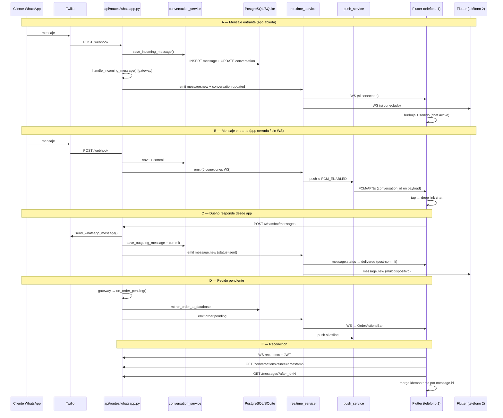

## v1.20


###########################################################
## v1.0.
Primer versión


###########################################################
## v1.1


## prompt ##


Aquí tienes un **prompt listo para copiar y pegar** en Cursor. Está alineado con tu repo actual (`final_system/`, FastAPI, Flutter `whatsbot_app`, polling 4s/8s, notificaciones locales sin FCM).

---

```
@PROMPT_EVOLUCION_SAAS_WHATSBOT.md
@README.md
@docs/FLUTTER_APP.md
@docs/ARCHITECTURE.md

# FASE 11 — WhatsBot tiempo real (paridad lógica con WhatsApp)

## Objetivo

La UI de WhatsBot ya imita WhatsApp. Ahora implementa la **lógica en tiempo real** equivalente: sin polling como mecanismo principal, con entrega instantánea de mensajes, notificaciones push reales, reconexión, estados de mensaje y comportamiento de app en foreground/background como WhatsApp.

**No reescribas el chatbot ni la UI desde cero.** Cambio incremental sobre lo existente.

---

## Estado actual (no romper)

| Componente | Hoy |
|------------|-----|
| Backend | FastAPI `python -m api.main`, REST en `/whatsbot/*`, webhook Twilio `POST /webhook` |
| Persistencia | PostgreSQL prod / SQLite dev — fuente de verdad |
| Flutter | `chat_screen.dart` polling 4s, `chats_list_screen.dart` polling 8s |
| Alertas | `MessageAlertsService` con `flutter_local_notifications` + sonido local (NO FCM/APNs) |
| Sesión móvil | `SharedPreferences` (JWT, business_id) |
| Gateway bot | `chatbot/gateway.py` → `handle_incoming_message()` — INTOCABLE en lógica de negocio |

**Problema:** polling no escala, no es instantáneo, gasta batería/datos, no se comporta como WhatsApp con app cerrada o en background.

---

## Meta de producto (paridad UX con WhatsApp)

Comportamientos que DEBEN quedar implementados (equivalente funcional, no clonar protocolo propietario de Meta):

### A. Tiempo real en app abierta
- [ ] **WebSocket** (preferido) o **SSE** desde FastAPI hacia Flutter, autenticado con JWT
- [ ] Al guardar mensaje entrante/saliente en BD → **emitir evento inmediato** al dueño conectado
- [ ] Lista de chats se actualiza al instante (nuevo mensaje, preview, timestamp, orden)
- [ ] Chat abierto recibe burbujas nuevas sin esperar timer
- [ ] **Eliminar polling** como mecanismo principal (`chatPollInterval`, `chatsRefreshInterval`); solo fallback de reconexión si WS cae

### B. App en background / cerrada (push real)
- [ ] **Firebase Cloud Messaging (Android)** + **APNs vía Firebase (iOS)**
- [ ] Registrar `device_token` por negocio/usuario al login; endpoint backend para guardar/actualizar token
- [ ] Cuando llega mensaje de cliente (webhook Twilio → `save_incoming_message`) y el dueño NO tiene WS activo → **enviar push FCM/APNs**
- [ ] Tap en notificación → abrir conversación correcta (deep link / payload `conversation_id`)
- [ ] Mantener notificaciones locales solo como fallback si FCM no está configurado

### C. Estados de mensaje (estilo WhatsApp)
- [ ] **Enviando** → **Enviado al servidor** → **Entregado** (guardado en BD / emitido por WS) → **Leído** (dueño abrió chat / marcó visto)
- [ ] Campos en BD si faltan (`status`, `delivered_at`, `read_at`) + eventos WS
- [ ] Checks dobles en mensajes salientes del dueño; ticks grises/azules en UI Flutter

### D. Presencia y actividad
- [ ] **Online / last seen** del dueño (opcional v1: solo “conectado ahora” vía heartbeat WS)
- [ ] **Typing indicator** cuando el dueño escribe (emitir evento WS; mostrar “escribiendo…” en chat — preparar hook aunque el cliente WhatsApp no escriba desde la app del dueño)

### E. Resiliencia (como apps de mensajería)
- [ ] Reconexión automática WS con backoff exponencial
- [ ] **Sync al reconectar:** `GET /whatsbot/conversations?since=` y mensajes `?after_id=` para no perder nada
- [ ] Idempotencia de eventos (no duplicar burbujas ni notificaciones)
- [ ] Multidispositivo: mismo negocio logueado en 2 teléfonos recibe eventos en ambos

### F. Pedidos en tiempo real
- [ ] Evento WS + push cuando hay pedido pendiente nuevo
- [ ] Barra Aprobar/Rechazar se actualiza sin polling

---

## Reglas absolutas

1. **Cero regresión** del chatbot Twilio y flujos de pedido/admin legacy
2. **No tocar** algoritmos de `chatbot/app/core/*` ni intents
3. Gateway sigue siendo `handle_incoming_message()` — solo engancha eventos DESPUÉS de persistir en BD
4. REST existente sigue funcionando (Flutter puede usar REST para historial inicial + WS para live)
5. Sin UI web — solo Flutter + API
6. Secrets FCM en `.env` del servidor, **nunca** en la app Flutter
7. Cambios incrementales por subfases; al cerrar cada subfase: nota en `docs/INCREMENTAL_GUIDE.md`
8. Tests nuevos + actualizar `scripts/validate_system.py` donde aplique

---

## Arquitectura propuesta

```
Cliente WhatsApp → Twilio → POST /webhook
                              ↓
                    save_incoming_message (PostgreSQL)
                              ↓
              ┌───────────────┴────────────────┐
              ↼                                ▼
    WebSocket hub (dueño conectado)     FCM/APNs (dueño offline)
              ↓                                ↓
         Flutter WhatsBot                  Flutter WhatsBot
    (actualiza UI al instante)         (notificación + abrir chat)
```

### Backend (FastAPI)
- Nuevo módulo ej. `api/routes/realtime.py` o `services/realtime_service.py`
- Endpoint: `WS /whatsbot/ws` (JWT en query o primer frame auth)
- Tipos de evento JSON mínimos:
  - `message.new`, `message.status`, `conversation.updated`
  - `order.pending`, `order.updated`
  - `typing.start`, `typing.stop` (opcional fase 3)
  - `ping` / `pong`
- Emitir desde:
  - `api/routes/whatsapp.py` (incoming/outgoing bot)
  - `api/routes/whatsbot.py` (mensaje del dueño, approve/reject pedido)
- Tabla `device_tokens(business_id, token, platform, updated_at)`
- Servicio push: Firebase Admin SDK en Python (`firebase-admin`) leyendo credenciales desde env

### Flutter
- Nuevo `RealtimeService` (WebSocket + stream)
- Integrar en `chat_screen`, `chats_list_screen`, `MessageAlertsService`
- Firebase Messaging: `firebase_core`, `firebase_messaging`
- Eliminar `Timer.periodic` de polling salvo fallback temporal documentado
- UI: ticks de estado, badge no leídos, “escribiendo…”

### Variables `.env` nuevas (documentar en `.env.example`)
- `FCM_ENABLED=true|false`
- `FCM_SERVICE_ACCOUNT_JSON` o path a JSON
- `REALTIME_ENABLED=true` (feature flag)
- `WS_HEARTBEAT_SECONDS=30`

---

## Plan incremental (ejecutar EN ORDEN, un chat por subfase)

### Subfase 11.1 — Análisis (SIN código)
Entregables:
- Mapa de archivos a tocar
- Diagrama de eventos
- Decisión WS vs SSE (justificar)
- Plan migración polling → realtime sin downtime

Espera mi "Sí" antes de 11.2.

### Subfase 11.2 — Backend WebSocket + eventos BD
- WS autenticado
- Hub por `business_id`
- Emitir `message.new` al guardar mensajes
- Tests API/WS
- REST `?since=` / `?after_id=` si no existen

### Subfase 11.3 — Flutter WebSocket + quitar polling
- Conectar al abrir app post-login
- Actualizar lista y chat en vivo
- Reconexión + sync
- Eliminar timers de polling

### Subfase 11.4 — Push FCM/APNs
- Registro token en login
- Push cuando WS no conectado
- Deep link a conversación
- Guía setup Firebase en `docs/FLUTTER_APP.md`

### Subfase 11.5 — Estados mensaje + ticks UI + pedidos live
- delivered/read
- Ticks en burbujas
- Eventos pedido pendiente

### Subfase 11.6 — Validación E2E
- Checklist manual WhatsApp-like
- `validate_system.py` ampliado
- `flutter analyze` sin issues
- Actualizar README sección tiempo real

---

## Checklist E2E (debe pasar al cerrar Fase 11)

- [ ] Cliente escribe por WhatsApp → dueño ve mensaje en app **< 1 s** con app abierta (sin polling)
- [ ] App en background → push FCM/APNs → tap abre el chat correcto
- [ ] Dueño responde → cliente recibe por Twilio (sin regresión)
- [ ] App cerrada → push llega
- [ ] Reconexión WiFi → no se pierden mensajes
- [ ] Dos teléfonos mismo negocio → ambos reciben eventos
- [ ] Pedido nuevo → notificación + barra approve sin refrescar manual
- [ ] Sin FCM configurado → WS sigue funcionando; degradación documentada
- [ ] Producción Railway: WS + Postgres + FCM operativos

---

## Instrucción inicial

Empieza **solo Subfase 11.1 (análisis, sin modificar código)**.

Contexto: hoy polling 4s/8s en Flutter; notificaciones locales; backend sin WebSocket. Queremos paridad lógica con WhatsApp (tiempo real + push + estados + reconexión).

Entrega el mapa de archivos, diagrama de eventos, decisión WS vs SSE, y plan de subfases 11.2–11.6.

¿Procedo con 11.2? (espera mi Sí)
```

---

**Nota honesta (para ti, no para el prompt):** no vas a clonar el protocolo interno de WhatsApp (MQTT/XMPP propietario). Este prompt pide **el mismo comportamiento percibido**: instantáneo, push con app cerrada, ticks, reconexión. Eso sí es alcanzable con WS + FCM.

Si quieres, en otro mensaje te armo también la versión **corta** (un solo bloque para pegar fase por fase como `PROMPTS_LISTOS.md`).


## resp cursor ##


# Fase 11.1 — Análisis (sin código)

Análisis del repo actual frente al objetivo de paridad lógica con WhatsApp. **No se ha modificado ningún archivo.**

---

## 1. Estado actual confirmado

| Área | Hallazgo en repo |
|------|------------------|
| **Polling Flutter** | `chat_screen.dart` → `Timer.periodic(4s)`; `chats_list_screen.dart` → `8s` (`api_config.dart`) |
| **Alertas** | `message_alerts_service.dart` — locales + sonido; depende del polling para detectar mensajes |
| **Backend realtime** | No hay WebSocket, SSE ni FCM |
| **Persistencia mensajes** | `save_incoming_message` / `save_outgoing_message` en `conversation_service.py`; sin hooks post-commit |
| **Modelo Message** | Sin `status`, `delivered_at`, `read_at` |
| **REST incremental** | `GET /whatsbot/conversations` y `.../messages` sin `?since=` ni `?after_id=` |
| **Pedidos live** | `on_order_pending()` en `notification_service.py` → admin legacy + `mirror_order_to_database`; Flutter hace polling de `/orders/pending` |
| **Auth** | JWT con `business_id` en `api/middleware/auth.py` — reutilizable para WS |
| **Gateway** | `chatbot/gateway.py` → `handle_incoming_message()` — **no tocar lógica**; solo enganchar eventos después de `db.commit()` |

---

## 2. Mapa de archivos a tocar

### Backend — nuevos

| Archivo | Rol |
|---------|-----|
| `services/realtime_service.py` | Hub in-memory por `business_id`; broadcast; tracking conexiones activas |
| `api/routes/realtime.py` | `WS /whatsbot/ws`; auth JWT; ping/pong |
| `services/push_service.py` | Firebase Admin SDK; envío FCM/APNs si dueño offline |
| `models/device_token.py` | Tabla `device_tokens` |
| `services/device_token_service.py` | CRUD tokens por negocio/plataforma |
| `api/schemas_realtime.py` (o ampliar `schemas.py`) | Payloads de eventos WS + registro token |
| `tests/test_realtime_ws.py` | WS auth, `message.new`, multidispositivo |
| `tests/test_push_service.py` | Push mock (sin FCM real en CI) |

### Backend — modificar (hooks mínimos)

| Archivo | Cambio |
|---------|--------|
| `api/main.py` | Registrar router realtime; lifespan opcional init FCM |
| `api/routes/whatsapp.py` | Tras `db.commit()` en incoming/outgoing → `emit_message_new()` |
| `api/routes/whatsbot.py` | Tras envío dueño; approve/reject; endpoint `POST /whatsbot/device-token`; `?since=` / `?after_id=` |
| `services/conversation_service.py` | Filtros `since` / `after_id`; `mark_read`; estados mensaje |
| `services/notification_service.py` | Tras `mirror_order_to_database` → `emit_order_pending()` + push |
| `models/message.py` | `status`, `delivered_at`, `read_at` |
| `api/schemas.py` | Campos nuevos en `MessageOut` |
| `scripts/migrate_db.py` | Migración columnas + tabla `device_tokens` |
| `config/settings.py` | `REALTIME_ENABLED`, `FCM_ENABLED`, `WS_HEARTBEAT_SECONDS`, credenciales FCM |
| `.env.example` | Variables Fase 11 |
| `requirements.txt` | `firebase-admin` |

### Flutter — nuevos

| Archivo | Rol |
|---------|-----|
| `lib/services/realtime_service.dart` | WebSocket, stream de eventos, reconexión backoff |
| `lib/services/push_service.dart` | `firebase_messaging`; registro token; deep link |
| `lib/models/realtime_event.dart` | Tipos de evento |
| `lib/widgets/message_status_ticks.dart` | Checks grises/azules |
| `lib/widgets/typing_indicator.dart` | “escribiendo…” (v1 opcional) |

### Flutter — modificar

| Archivo | Cambio |
|---------|--------|
| `lib/config/api_config.dart` | URL WS; quitar o marcar deprecated intervals de polling |
| `lib/services/api_client.dart` | `since`/`after_id`; `registerDeviceToken`; `markMessagesRead` |
| `lib/models/message.dart` | `status`, `deliveredAt`, `readAt` |
| `lib/screens/chat_screen.dart` | Suscribirse a stream; quitar timer; typing emit; ticks |
| `lib/screens/chats_list_screen.dart` | Stream `conversation.updated`; quitar timer |
| `lib/services/message_alerts_service.dart` | Eventos WS en foreground; FCM en background; local como fallback |
| `lib/main.dart` | Init Firebase + `RealtimeService` post-login |
| `lib/widgets/message_bubble.dart` | Hora + ticks en salientes |
| `pubspec.yaml` | `firebase_core`, `firebase_messaging`, `web_socket_channel` |
| `android/` + `ios/` | Config Firebase (google-services.json, GoogleService-Info.plist) |

### Docs / validación

| Archivo | Cambio |
|---------|--------|
| `docs/INCREMENTAL_GUIDE.md` | Notas 11.2–11.6 |
| `docs/FLUTTER_APP.md` | Setup Firebase, WS, degradación sin FCM |
| `docs/ARCHITECTURE.md` | Diagrama realtime |
| `README.md` | Sección tiempo real |
| `scripts/validate_system.py` | Checks WS + sync incremental |

### Intocable (solo lectura / enganche post-persist)

| Archivo | Regla |
|---------|-------|
| `chatbot/gateway.py` | Sin cambios de lógica |
| `chatbot/app/core/*` | Sin tocar intents/flow |
| `chatbot/app/services/admin_service.py` | Legacy admin intacto |

---

## 3. Diagrama de eventos



### Catálogo de eventos WS (JSON)

| `type` | Cuándo | Payload mínimo |
|--------|--------|----------------|
| `message.new` | Tras commit incoming/outgoing | `message`, `conversation` |
| `message.status` | delivered / read | `message_id`, `status`, `at` |
| `conversation.updated` | Preview/timestamp cambia | `conversation_id`, `preview`, `last_message_at` |
| `order.pending` | `mirror_order_to_database` | `order` |
| `order.updated` | approve/reject | `order_id`, `status` |
| `typing.start` / `typing.stop` | Dueño escribe (v1) | `conversation_id`, `business_id` |
| `presence.online` | Heartbeat WS | `business_id`, `at` |
| `ping` / `pong` | Keepalive | — |

---

## 4. Decisión: WebSocket vs SSE

### Recomendación: **WebSocket**

| Criterio | WebSocket | SSE |
|----------|-----------|-----|
| **Bidireccional** | Nativo (typing, read receipts, ping) | Solo servidor→cliente; typing requiere REST extra |
| **Flutter** | `web_socket_channel` maduro | Menos idiomático; reconexión manual |
| **FastAPI** | `WebSocket` nativo en Starlette | `StreamingResponse` funciona pero sin frames cliente |
| **Multidispositivo** | Mismo hub, N conexiones por `business_id` | Igual, pero sin canal cliente→servidor |
| **Batería/datos** | Un socket persistente; heartbeat 30s | Reconexión HTTP larga; proxies pueden cortar |
| **Railway / ngrok** | Soportado con upgrade; documentar sticky sessions | Más frágil con timeouts de proxy |
| **Estados mensaje** | `message.status` en ambos sentidos | Marcar leído = POST adicional (aceptable pero peor UX dev) |

**SSE solo tendría sentido** si se quisiera evitar WS en infraestructura muy restrictiva. En este proyecto (FastAPI + Flutter + typing + presence + heartbeat) **WS es la opción correcta**.

**Nota producción (Railway):** el hub in-memory funciona en **una instancia**. Si escalas a N réplicas, hará falta `REDIS_URL` (ya en `.env.example`) como pub/sub entre workers — planificar en 11.2 como extensión, no bloqueante para MVP single-instance.

---

## 5. Plan de migración polling → realtime (sin downtime)

### Principio: feature flag + degradación gradual

```
REALTIME_ENABLED=true|false  (backend)
USE_REALTIME=true|false      (Flutter, compile-time o remoto vía /health)
```

### Fases de rollout

| Paso | Comportamiento |
|------|----------------|
| **11.2** | Backend emite eventos; REST sin cambios; polling sigue en Flutter |
| **11.3** | Flutter conecta WS; **dual mode**: WS primario + polling fallback cada 30–60s si WS caído |
| **11.4** | FCM para background; polling fallback solo si `WS down && !FCM` |
| **11.5** | Estados + ticks; quitar polling de chat/lista cuando WS estable |
| **11.6** | `REALTIME_ENABLED` on por defecto; polling eliminado salvo reconexión documentada |

### Idempotencia (evitar duplicados)

- Flutter mantiene `Set<int> _knownMessageIds` por conversación.
- Eventos WS con `message.id`; ignorar si `id <= maxKnown`.
- `MessageAlertsService._notifiedMessageIds` se reutiliza para push/WS.
- Sync post-reconexión: `after_id=maxKnown` — merge sin duplicar burbujas.

### Reconexión

```
backoff: 1s → 2s → 4s → 8s → 30s (cap)
on open: GET conversations?since=lastSyncAt
         GET messages?after_id=lastId (chat activo)
heartbeat: ping cada WS_HEARTBEAT_SECONDS (30)
```

### Puntos de enganche (sin tocar gateway)

```python
# Patrón en whatsapp.py / whatsbot.py — DESPUÉS de db.commit()
if settings.REALTIME_ENABLED:
    await realtime_service.emit_to_business(business_id, event)
    if not realtime_service.has_active_connection(business_id):
        await push_service.maybe_notify(business_id, event)
```

`conversation_service` **no** debe importar realtime (evitar acoplamiento); los routes son el único punto de emisión.

---

## 6. Plan detallado subfases 11.2–11.6

### 11.2 — Backend WebSocket + eventos BD

- `RealtimeHub`: `dict[business_id, set[WebSocket]]`
- Auth: JWT en query `?token=` (estándar móvil) o primer frame `{"type":"auth","token":"..."}`
- Hooks en `whatsapp.py` (líneas ~88, ~122) y `whatsbot.py` (`send_owner_message`)
- REST incremental:
  - `GET /whatsbot/conversations?since=ISO8601`
  - `GET /whatsbot/conversations/{id}/messages?after_id=N`
- Tests: conexión, auth inválida, broadcast 2 clientes mismo `business_id`
- **Entregable:** nota en `INCREMENTAL_GUIDE.md`

### 11.3 — Flutter WebSocket + reducir polling

- `RealtimeService` singleton; conectar en `ChatsListScreen.initState` post-login
- `chat_screen`: listener `message.new` filtrado por `conversation_id`
- `chats_list_screen`: listener `conversation.updated` → reorder lista
- Fallback: timer 30s solo si `!realtime.isConnected`
- `api_client`: métodos sync incremental
- **Entregable:** mensaje cliente visible &lt;1s con app abierta (manual)

### 11.4 — Push FCM/APNs

- Tabla `device_tokens`; `POST /whatsbot/device-token`
- `firebase-admin` en servidor; secrets en `.env`
- Flutter: `firebase_core` + `firebase_messaging`; registrar token en login
- Payload: `{type, conversation_id, preview}`; tap → `navigatorKey` + `ChatScreen`
- `MessageAlertsService`: FCM foreground handler; locales si `!FCM_ENABLED`
- Guía Firebase en `docs/FLUTTER_APP.md`
- **Entregable:** push con app en background (manual)

### 11.5 — Estados mensaje + ticks + pedidos live

- Migración BD: `status` (`sending|sent|delivered|read`), timestamps
- Dueño abre chat → `POST .../mark-read` o evento WS `read`
- `message_bubble.dart`: ✓ gris (sent/delivered), ✓✓ azul (read)
- `order.pending` / `order.updated` en WS; quitar polling `/orders/pending` en chat
- Typing v1: emitir en `TextField.onChanged` (debounce 300ms)
- **Entregable:** ticks visibles; barra pedido sin refresh manual

### 11.6 — Validación E2E

- Checklist manual (del prompt)
- `validate_system.py`: WS connect + `message.new` tras webhook simulado
- `pytest` ampliado; `flutter analyze` limpio
- README sección “Tiempo real”
- Polling eliminado de `api_config.dart` (o documentado como emergency fallback)

---

## 7. Riesgos y mitigaciones

| Riesgo | Mitigación |
|--------|------------|
| WS cortado por proxy/ngrok free | Documentar URL estable; heartbeat; fallback sync REST |
| Multi-instancia Railway sin Redis | MVP single worker; flag `REDIS_URL` para pub/sub en 11.2+ |
| FCM no configurado en dev | `FCM_ENABLED=false`; WS + notificaciones locales |
| Regresión webhook Twilio | Tests existentes + `validate_chatbot.py` en cada subfase |
| JWT expira con WS largo | Reauth en reconexión; token refresh opcional v2 |
| Duplicados WS + polling dual | Idempotencia por `message.id`; quitar polling en 11.5 |

---

## 8. Dependencias nuevas previstas

**Python:** `firebase-admin`  
**Flutter:** `firebase_core`, `firebase_messaging`, `web_socket_channel`

**`.env` nuevas:**
```env
REALTIME_ENABLED=true
FCM_ENABLED=false
FCM_SERVICE_ACCOUNT_JSON_PATH=credentials/firebase-service-account.json
WS_HEARTBEAT_SECONDS=30
```

---

## Resumen ejecutivo

El repo está listo para un cambio **incremental**: los puntos de persistencia ya existen (`conversation_service` + routes); falta la capa de distribución (WS hub + FCM) y la suscripción en Flutter. WebSocket gana sobre SSE por bidireccionalidad (typing, read, heartbeat) y mejor encaje con FastAPI/Flutter. La migración puede hacerse con feature flags, dual mode temporal y sync `since`/`after_id` en reconexión, sin tocar `chatbot/gateway.py`.

---

**¿Procedo con la Subfase 11.2 (Backend WebSocket + eventos BD)?** Responde **Sí** cuando quieras que empiece a implementar.


## segundo prompt ##

si


## resp cursor ##

**Subfase 11.2 completada.** Backend WebSocket operativo; 23 tests pasan; gateway intacto.

## Qué se implementó

### Hub realtime
- `services/realtime_service.py` — hub in-memory por `business_id`, broadcast multidispositivo
- Eventos: `message.new`, `conversation.updated`, `connected`, `ping`/`pong`

### WebSocket autenticado
- `WS /whatsbot/ws?token=<JWT>` en `api/routes/realtime.py`
- Mismo JWT que REST (`business_id` en el claim)
- Heartbeat servidor cada `WS_HEARTBEAT_SECONDS` (default 30s)

### Emisión tras persistir en BD
- `api/routes/whatsapp.py` — incoming del cliente + outgoing del bot (después de `commit`)
- `api/routes/whatsbot.py` — mensaje del dueño desde la app

### REST incremental (sync al reconectar)
- `GET /whatsbot/conversations?since=ISO8601`
- `GET /whatsbot/conversations/{id}/messages?after_id=N`

### Config
- `REALTIME_ENABLED=true` (por defecto)
- `WS_HEARTBEAT_SECONDS=30`
- `/health` incluye `realtime_enabled`

### Tests
- `tests/test_realtime_ws.py` — 8 tests: auth, pong, `message.new`, multidispositivo, webhook, filtros `since`/`after_id`

---

## Probar manualmente

1. Login → copiar `access_token`
2. Conectar con cualquier cliente WS:
   ```
   wss://{API_PUBLIC_URL}/whatsbot/ws?token={JWT}
   ```
3. Recibirás `{"type":"connected",...}`
4. Enviar mensaje al bot por WhatsApp → llega `message.new` al instante

---

## Siguiente paso: 11.3

Flutter `RealtimeService`, suscripción en lista/chat, reconexión con sync, y reducir polling.

¿Procedo con **11.3**?


##############################################3
## v1.2

## prompt ##

Sí


## Resp cursor ##


**Subfase 11.3 completada.** La app Flutter usa WebSocket en tiempo real; `flutter analyze` sin issues.

## Cambios principales

### Nuevo `RealtimeService`
- Conecta a `wss://{API}/whatsbot/ws?token=JWT` tras login o restaurar sesión
- Reconexión automática con backoff (1s → 2s → 4s → … → 30s)
- Responde `ping` del servidor con `pong`
- Al reconectar: sync REST con `?since=` para conversaciones perdidas

### Pantallas actualizadas
- **Lista de chats** — escucha `message.new` y `conversation.updated`; reordena al instante
- **Chat** — burbujas nuevas vía WS; idempotencia por `message.id`
- **Polling eliminado** (4s/8s) → fallback REST cada **30s** solo si el WS está caído (icono nube en AppBar)

### Otros
- Alertas desde eventos WS (`handleRealtimeMessage`)
- Logout desconecta el WS
- `api_client`: `accessToken`, `getConversations(since:)`, `getMessages(afterId:)`

---

## Cómo probar

1. Reinicia la app (`flutter run` de nuevo — hot reload no basta para el nuevo servicio)
2. Backend con `REALTIME_ENABLED=true`
3. Login → deja la lista de chats abierta
4. Envía un WhatsApp al bot → el chat debe aparecer/actualizarse al instante (sin esperar 4s)

Si ves el icono de nube en el AppBar, el WS no está conectado y entra el fallback REST de 30s.

---

## Pendiente (11.4+)

- Push FCM con app en background/cerrada
- Ticks de estado (✓ / ✓✓)
- Pedidos live sin polling REST

¿Procedo con **11.4 (FCM/APNs)**?


###########################################################
## v1.3

## prompt ##

Sí


## Resp cursor ##

**Subfase 11.4 completada.** Push FCM/APNs en backend y Flutter; 27 tests pasan; `flutter analyze` limpio.

## Backend

| Componente | Detalle |
|------------|---------|
| `models/device_token.py` | Tabla `device_tokens` por negocio |
| `services/push_service.py` | Firebase Admin SDK; push solo si **no hay WS** y mensaje **entrante** |
| API | `POST /whatsbot/device-token`, `DELETE /whatsbot/device-token` |
| Config | `FCM_ENABLED`, `FCM_SERVICE_ACCOUNT_JSON_PATH` en `.env` |
| Hook | Tras `emit_message_saved` → `maybe_push_incoming_message` |

## Flutter

| Componente | Detalle |
|------------|---------|
| `lib/services/push_service.dart` | Registro token en login; tap en notificación → abre chat |
| Degradación | Sin `google-services.json` la app sigue con WS + notificaciones locales |
| Logout | Desregistra token en servidor |

## Configurar push (cuando quieras activarlo)

1. Firebase Console → apps Android + iOS  
2. `google-services.json` → `whatsbot_app/android/app/`  
3. `GoogleService-Info.plist` → `whatsbot_app/ios/Runner/`  
4. Clave de servicio JSON → `final_system/credentials/firebase-service-account.json`  
5. En `.env`:
   ```env
   FCM_ENABLED=true
   FCM_SERVICE_ACCOUNT_JSON_PATH=credentials/firebase-service-account.json
   ```
6. `python -m pip install -r requirements.txt` y reiniciar API  
7. Recompilar app: `flutter run`

Guía completa en `docs/FLUTTER_APP.md`.

## Flujo

```
Cliente escribe → webhook → BD → WS (si app abierta)
                              └→ FCM (si ningún WS conectado)
```

---

¿Procedo con **11.5** (estados de mensaje, ticks ✓/✓✓, pedidos live)?


#########################################################
## v1.4


## prompt ##

si


## resp cursor ##


**Subfase 11.5 completada.** 29 tests pasan; `flutter analyze` limpio.

## Backend

| Cambio | Detalle |
|--------|---------|
| **BD** | `messages.status`, `delivered_at`, `read_at` |
| **Migración** | `python scripts/migrate_message_status.py` (también en `migrate_db.py`) |
| **Estados** | Entrante → `delivered`; saliente dueño → `sent` → `delivered` tras WS |
| **Mark read** | `POST /whatsbot/conversations/{id}/mark-read` → incoming `read` + ticks azules en salientes del dueño |
| **WS** | `message.status`, `order.pending`, `order.updated`, `typing.start/stop` |
| **Pedidos** | Emitidos al crear pedido en BD y al aprobar/rechazar |

## Flutter

| Cambio | Detalle |
|--------|---------|
| **Ticks** | `message_status_ticks.dart` — ✓ gris (sent), ✓✓ gris (delivered), ✓✓ azul (read) |
| **Chat** | `mark-read` al abrir; escucha `message.status` y pedidos live |
| **Pedidos** | Barra Aprobar/Rechazar vía WS (sin polling REST en refresh) |
| **Typing** | Indicador “escribiendo…” vía WS al escribir en el input |

## Migración en tu entorno

Si ya tenías BD creada antes de esta fase:

```bash
cd final_system
python scripts/migrate_message_status.py
```

Luego reinicia API y recompila la app.

---

## Cómo probar

1. Dueño envía mensaje → ticks ✓✓ grises al instante  
2. Abre chat con mensajes entrantes → `mark-read` → entrantes marcados leídos  
3. Cliente hace pedido → barra amarilla aparece sin refrescar manual  
4. Escribir en el input → evento typing (visible en otro dispositivo conectado al mismo negocio)

---

¿Procedo con **11.6** (validación E2E, `validate_system.py`, README)?


##########################################################
## v1.5


## prompt ##

Sí


## resp cursor ##


**Fase 11 cerrada.** Subfase 11.6 completada; validación E2E en verde.

## 11.6 — Qué se hizo

### `validate_system.py` ampliado
Nueva sección **Realtime (Fase 11)**:
- `realtime_enabled` en `/health`
- `POST /whatsbot/device-token`
- WS connect + ping/pong
- `message.new` tras envío del dueño
- `POST mark-read` + `GET conversations?since=`
- Migración `migrate_message_status` en el setup

### Documentación
- **README.md** — sección tiempo real, variables `.env`, checklist Fase 11
- **ARCHITECTURE.md** — diagrama WS + FCM
- **INCREMENTAL_GUIDE.md** — nota 11.6, fase cerrada
- API versión **0.9.0**

### Validación ejecutada

| Check | Resultado |
|-------|-----------|
| `validate_system.py` | **0 fallos** |
| `validate_chatbot.py` | **0 fallos** |
| `pytest tests/` | **29 passed** |
| `flutter analyze` | **No issues** (de fases anteriores) |

---

## Resumen Fase 11 completa

| Subfase | Entregable |
|---------|------------|
| **11.1** | Análisis WS vs SSE, mapa de archivos |
| **11.2** | Backend WS + eventos BD + sync REST |
| **11.3** | Flutter `RealtimeService`, sin polling principal |
| **11.4** | Push FCM/APNs + device tokens |
| **11.5** | Estados mensaje, ticks, pedidos live, typing |
| **11.6** | E2E automatizado + docs |

---

## En tu entorno (si aún no lo hiciste)

```bash
cd final_system
python scripts/migrate_message_status.py
python -m api.main
# Otra terminal:
cd whatsbot_app && flutter run
```

Para push real: configura Firebase según `docs/FLUTTER_APP.md` y `FCM_ENABLED=true` en `.env`.

---

## Pendiente opcional (fuera de Fase 11)

- Redis pub/sub para múltiples instancias Railway
- Read receipts reales vía Twilio
- Typing desde el cliente WhatsApp (no solo el dueño en la app)

¿Quieres que arme el bloque corto en `README_PROMPTS.md` para futuras fases, o prefieres probar el flujo manual primero?


###########################################################
## v1.6


## prompt ##


¿Quieres que arme el bloque corto en README_PROMPTS.md para futuras fases, o prefieres probar el flujo manual primero?

No, actualiza prompts_listos que es donde se guarda todo eso, no toques readme_prompts, y aparte, sugiereme qué hacer ahora


## resp cursor ##


`PROMPTS_LISTOS.md` actualizado con la Fase 11 (prompts 12–17 marcados como hechos) y plantillas para Fase 12+ (prompts 18–22). `README_PROMPTS.md` no se tocó.

---

## Qué hacer ahora (orden recomendado)

### 1. Prueba manual en tu teléfono (30 min) — lo más urgente

Tienes `flutter run --release` activo. Valida el flujo real:

1. `python scripts/migrate_message_status.py` (si no lo corriste en tu BD de dev)
2. API con `REALTIME_ENABLED=true`
3. Login → cliente escribe al bot → mensaje **al instante** en la lista/chat
4. Respondes desde la app → cliente recibe por WhatsApp
5. Pedido de prueba → barra Aprobar/Rechazar sin refrescar

Si algo falla, anota qué pantalla y si ves el icono de nube (WS caído).

### 2. Firebase push (si quieres app cerrada/background)

Usa **Prompt 19** de `PROMPTS_LISTOS.md`. Sin Firebase, el sistema ya funciona con WS + notificaciones locales; push real es el único hueco de paridad con WhatsApp con app muerta.

### 3. Producción estable

Usa **Prompt 18** cuando quieras dejar de depender de ngrok en el PC:
- Railway/Render + PostgreSQL
- `API_PUBLIC_URL` HTTPS fija
- Webhook Twilio apuntando ahí
- `api_config.dart` con esa URL

### 4. Segundo negocio o cliente real

**Prompt 21** — `onboard_business.py` + nuevo número Twilio.

### 5. Solo si escalas a varias instancias API

**Prompt 20** (Redis) — no hace falta con un solo servidor.

---

## Mi sugerencia concreta

**Hoy:** prueba manual (paso 1). Es lo que confirma que los 29 tests automatizados se traducen en experiencia real en tu red/ngrok.

**Esta semana:** Firebase (paso 2) o deploy estable (paso 3), según lo que más te duela: ¿app cerrada sin avisos? → Firebase. ¿API se cae al apagar el PC? → deploy.

¿Quieres que te guíe paso a paso la prueba manual (qué mirar en logs si el WS no conecta) o el setup Firebase?


###########################################################
## v1.7

## prompt ##

No hagas nada, solo dime qué debo hacer ahora, las notificaciones funcionan com owhatsapp? por qué dices esto?

2. Firebase push (si quieres app cerrada/background)
Usa Prompt 19 de PROMPTS_LISTOS.md. Sin Firebase, el sistema ya funciona con WS + notificaciones locales; push real es el único hueco de paridad con WhatsApp con app muerta.

No hagas naa solo responde


## resp cursor ##

Sí: **ya está implementado en el código** (backend + Flutter). Lo que falta es **configurarlo en Firebase y en tu `.env`** — no hay que programar de nuevo la lógica push.

---

## Qué ya existe en el repo

| Parte | Qué hace |
|-------|----------|
| **Backend** | `push_service.py` — si `FCM_ENABLED=true` y no hay WebSocket activo, envía push al llegar un mensaje del cliente |
| **API** | `POST/DELETE /whatsbot/device-token` — la app registra el token al hacer login |
| **Flutter** | `push_service.dart` — pide token FCM, lo manda al servidor, tap en notificación abre el chat |
| **Docs** | `docs/FLUTTER_APP.md` sección **Push FCM/APNs** |

Por defecto está **apagado**: `FCM_ENABLED=false` en `.env.example`.

---

## Qué debes hacer tú (configuración, no código)

### 1. Firebase Console
- Crear proyecto en [console.firebase.google.com](https://console.firebase.google.com)
- Añadir app **Android** (`com.whatsbot.whatsbot_app`)
- Añadir app **iOS** (mismo bundle id que en Xcode)

### 2. Archivos en la app Flutter
- **Android:** descargar `google-services.json` → `whatsbot_app/android/app/google-services.json`
- **iOS:** descargar `GoogleService-Info.plist` → `whatsbot_app/ios/Runner/GoogleService-Info.plist`
- En Xcode: capability **Push Notifications** (en iOS)

### 3. Clave de servicio para el servidor
- Firebase → Configuración del proyecto → Cuentas de servicio → Generar clave JSON
- Guardar en algo como `final_system/credentials/firebase-service-account.json` (está en gitignore)

### 4. `.env` del backend (`final_system/.env`)
```env
FCM_ENABLED=true
FCM_SERVICE_ACCOUNT_JSON_PATH=credentials/firebase-service-account.json
```

### 5. Dependencias y rebuild
```bash
pip install -r requirements.txt   # firebase-admin
cd whatsbot_app && flutter pub get && flutter run   # recompilar app
```

### 6. iOS extra (solo si usas iPhone)
- Subir clave APNs en Firebase (Cloud Messaging)
- Certificado/provisioning con push habilitado

---

## Cómo comprobar que funciona

1. Login en la app (registra el token en el servidor)
2. **Cierra la app por completo** (no solo minimizar)
3. Cliente escribe al bot por WhatsApp
4. Debe llegar notificación del **sistema** (no solo sonido interno de la app)
5. Tap → abre el chat correcto

---

## Si no pones los archivos de Firebase

La app **no rompe**: `PushService.init()` falla en silencio y sigues con WebSocket + notificaciones locales. El plugin de Gradle solo se aplica si existe `google-services.json` en `android/app/`.

---

**Resumen:** la lógica push ya está; tú solo conectas Firebase (archivos + `.env` + rebuild). Si quieres que te guíe paso a paso en un chat nuevo, usa el **Prompt 19** de `PROMPTS_LISTOS.md`.


## segundo prompt ##

No hagas nada solo responde: en @PROMPTS_LISTOS.md , qué prompts hay? osea dame un resumen no hagas nada solo dime prompt 19 para tal cosa y así


## resp cursor ##


Resumen de `PROMPTS_LISTOS.md` (solo lectura):

---

## Base del proyecto (Fases 0–10) — ya hechas ✅

| Prompt | Para qué |
|--------|----------|
| **0** | Verificar que pegaste el bot en la raíz (sin tocar nada) |
| **1** | Fase 0 — Análisis del bot legacy, sin código |
| **2** | Fase 1 — Scaffold `final_system/` + `.env` |
| **3** | Fase 2 — Copiar chatbot + gateway |
| **4** | Fase 3 — Config centralizada |
| **5** | Fase 4 — API FastAPI + webhook + mensajes en BD |
| **6** | Fase 5 — Multi-negocio (business, menú, pedidos) |
| **7** | Fase 6 — Pedidos + confirmación ADMIN WhatsApp legacy |
| **8** | Fase 7 — API REST para Flutter (chats, menú, intents) |
| **9** | Fase 8 — Google Sheets opcional |
| **10** | Fase 9 — App Flutter UI tipo WhatsApp |
| **11** | Fase 10 — Validación final + README + guías |
| **11b** | Si faltan credenciales después de Fase 1 |

---

## Utilidades (numeración vieja — ojo, choca con Fase 11)

| Prompt | Para qué |
|--------|----------|
| **12** (viejo) | Corregir una fase que falló |
| **13** (viejo) | Mejora incremental genérica post-proyecto |
| **14** (viejo) | Alta de un negocio en producción |

---

## Fase 11 — Tiempo real — ya hecha ✅

| Prompt | Para qué |
|--------|----------|
| **12** (11.1) | Análisis WS vs SSE, sin código |
| **13** (11.2) | Backend WebSocket + eventos |
| **14** (11.3) | Flutter WebSocket, quitar polling |
| **15** (11.4) | Push FCM/APNs (código; tú configuras Firebase) |
| **16** (11.5) | Ticks de mensaje + pedidos live + typing |
| **17** (11.6) | Validación E2E + `validate_system.py` |

---

## Fase 12+ — Pendiente (lo que te toca ahora)

| Prompt | Para qué |
|--------|----------|
| **18** | Deploy producción (Railway, HTTPS, webhook estable) |
| **19** | **Configurar Firebase push de punta a punta** (app cerrada) |
| **20** | Redis si escalas a varias instancias API |
| **21** | Dar de alta un segundo negocio en producción |
| **22** | Plantilla para cualquier mejora incremental nueva |

---

## Extra (sin número de prompt)

- **Continuar en chat nuevo** — retomar desde Fase N en un chat limpio

---

**Nota:** Los prompts **12–14** están duplicados (utilidades viejas vs Fase 11). Para tiempo real usa los de la sección **Fase 11**; para “arreglar un fallo” usa el **12 viejo** (Corrección).

**Para Firebase:** **Prompt 19**.


## tercer prompt ##


Ok entonces, como mejora incremental, actualiza los prompts de ahí que estén (viejo) para que estén bien


## resp cursor ##


Actualicé `PROMPTS_LISTOS.md` (no toqué `README_PROMPTS.md`). Cambios principales:

### Problema resuelto
Los viejos **Prompt 12–14** (corrección, mejora incremental, alta negocio) chocaban con la **Fase 11** (también 12–17).

### Nueva numeración

| Antes (viejo) | Ahora |
|---------------|-------|
| Prompt 12 Corrección | **U1** (utilidad) |
| Prompt 13 Mejora incremental | **22** (plantilla unificada y mejorada) |
| Prompt 14 Alta negocio | **21** (con campos Nombre/Twilio/Admin) |
| Continuar chat nuevo | **U2** |

### Otros ajustes
- **Índice rápido** al inicio con todos los prompts y su estado
- Fase 11 marcada como **ya implementada** (auditar si se re-ejecuta)
- Prompt 10: nota de que el polling se sustituye en Fase 11
- Prompt 15: aclara que Firebase lo configuras tú (Prompt 19)
- Resumen visual simplificado al final

### Qué usar ahora

| Objetivo | Prompt |
|----------|--------|
| Deploy estable | **18** |
| Push con app cerrada | **19** |
| Nuevo negocio | **21** |
| Cualquier mejora nueva | **22** |
| Algo falló | **U1** |
| Chat nuevo / retomar | **U2** |


########################################################
## v1.8

## prompt ##

ok entonces dame un MD en la raiz que de los pasos de cómo poner el proyecto en producción con docker sencillo y facil solo un documento e incluye todo lo necesario


## resp cursor ##

Listo. Creé **`DEPLOY_DOCKER.md`** en la raíz del proyecto. Es un solo documento con todo lo necesario:

### Qué incluye
- Arquitectura (Caddy HTTPS → API → PostgreSQL)
- Requisitos (VPS, dominio, Docker, credenciales)
- **3 archivos para copiar:** `Dockerfile`, `docker-compose.yml`, `Caddyfile`
- Plantilla `.env` de producción (Twilio, JWT, PIN, PostgreSQL, tiempo real)
- Pasos numerados del 1 al 8
- Inicialización de BD (`migrate_db` + `onboard`) — **solo la primera vez**
- Configuración webhook Twilio
- Compilar Flutter APK con la URL de producción
- Comandos útiles, firewall, backup
- Firebase opcional (app cerrada)
- Segundo negocio y troubleshooting

### Flujo resumido
1. VPS + dominio + Docker  
2. Crear los 3 archivos Docker del doc  
3. Rellenar `.env`  
4. `docker compose up -d --build`  
5. Migrar BD una vez  
6. Twilio → `https://tu-dominio/webhook`  
7. Flutter con `apiBaseUrl` HTTPS → `flutter build apk`  

Los archivos Docker **no están creados en el repo** todavía — van dentro del MD para que los copies cuando despliegues. Si quieres, en otro mensaje puedo añadir `Dockerfile`, `docker-compose.yml` y `Caddyfile` reales al proyecto para no tener que copiarlos a mano.


#########################################################
## v1.9


## 1 implementación

Se hizo

python scripts/migrate_db.py

para inicializar DB


##########################################################
## v1.10

## prompt ##

@PROMPT_EVOLUCION_SAAS_WHATSBOT.md
@docs/INCREMENTAL_GUIDE.md


MEJORA: [
    
Te voy a pasar una serie de mejoras y quiero que me des un breve resumen al final de cada una y verifica que funcione correctamente.
1. Cuando se confirma pedido por parte del admin del restaurante, el cliente no recibe la confirmación de parte del bot, arregla eso
2. Cuando el admin chatea con el bot, todos los chats se mandan como si fueran del bot (desde WhatsBot) la idea es que se vea como una comunicación normal
3. Cuando un mensaje nuevo llega, el último mensaje del último chat debería ponerse de primero como en whatsapp, no? osea que no esté revisando constantemente sino que cuando sepa que llegó, ya sabe que tiene que acomodarlo de primero

4.Cuando entro a un chat, debería iniciar en el final, algunas no inician al final del chat y hay que dealizar para bajar al final, arregla eso

5. Cuando entro a un chat y salgo, me muestra como si no lo hubiera leido, verifica bien el tema de chats leidos y no y verifica que funcione correctamente

]

REGLAS:
- Cambio mínimo; no tocar lógica de chatbot/gateway ni intents
- UI solo Flutter (whatsbot_app/)
- Si toca API: validate_system.py + pytest
- Nota breve en docs/INCREMENTAL_GUIDE.md
- validate_chatbot.py al final si tocaste backend


## resp cursor ##


Implementé las 5 mejoras. Resumen breve de cada una:

---

### 1. Confirmación de pedido al cliente
**Problema:** Al aprobar desde la app, el WhatsApp al cliente podía fallar en silencio y la confirmación no quedaba en el historial del chat.

**Arreglo (backend):** `approve_order_from_app` ahora verifica el resultado de Twilio, devuelve `ok: false` si falla, guarda el mensaje en BD y emite `message.new`. La app solo limpia el pedido pendiente si `ok: true`.

**Verificado:** 5/5 tests en `test_order_confirmation_flow.py` + `validate_chatbot.py` OK.

---

### 2. Mensajes del admin vs. del bot
**Problema:** Todos los mensajes salientes se veían iguales, como si fueran del bot.

**Arreglo (Flutter):** Las respuestas automáticas del bot muestran etiqueta «WhatsBot» y burbuja distinta; los mensajes del dueño (`is_admin=true`) se ven como chat normal, con ticks de estado.

**Verificado:** `flutter analyze` sin errores.

---

### 3. Reorden de chats al llegar mensaje
**Problema:** El chat con mensaje nuevo no subía al tope de forma fiable.

**Arreglo (Flutter):** En `message.new` por WebSocket se actualiza preview/timestamp y se reordena al instante, sin esperar al polling. Si falta la conversación en memoria, se hace fetch silencioso.

**Verificado:** Lógica en `chats_list_screen.dart` con `_mergeConversationWithMessage` + `_sortConversations`.

---

### 4. Scroll al final al abrir chat
**Problema:** Algunos chats no iniciaban abajo; había que deslizar manualmente.

**Arreglo (Flutter):** Primera carga usa `jumpTo` con doble `postFrameCallback` (tras el layout del `ListView`). El polling silencioso ya no fuerza scroll si no estás cerca del final.

**Verificado:** `flutter analyze` OK.

---

### 5. Leído / no leído al salir del chat
**Problema:** Al entrar y salir, el chat volvía a marcarse como no leído (mensajes salientes actualizaban `lastMessageAt` pero `seenAt` quedaba desfasado).

**Arreglo (Flutter):** `seenAt` se alinea al timestamp del último mensaje al cargar, al recibir mensajes y al salir del chat (`dispose`). Ya no se marca como leído solo con `DateTime.now()` al entrar.

**Verificado:** `flutter analyze` OK.

---

**Validaciones ejecutadas:**
- `pytest tests/test_order_confirmation_flow.py` → 5 passed
- `python scripts/validate_chatbot.py` → 0 fallos
- `flutter analyze lib/` → sin issues

Nota documentada en `docs/INCREMENTAL_GUIDE.md`. Para probar en el dispositivo con `flutter run --release` que ya tienes corriendo, haz hot restart o rebuild para cargar los cambios.


##########################################################
## v1.11


## prompt ##

Lee este prompt:

[


Analiza toda la arquitectura actual del sistema de chat y propón una mejora profesional estilo WhatsApp para soportar funcionamiento offline-first.

Objetivo:

- Los chats deben permanecer visibles aunque el usuario pierda internet.
- Los mensajes deben almacenarse localmente en el dispositivo.
- Al abrir un chat NO debe depender de una petición HTTP para mostrar mensajes.
- La interfaz debe cargar instantáneamente desde almacenamiento local.
- Cuando vuelva la conexión, el sistema debe sincronizar automáticamente cambios pendientes.
- Evitar polling constante o recargas repetitivas.
- Diseñar una arquitectura eficiente y escalable.

Quiero que evalúes:

1. Cómo se almacenan actualmente los mensajes.
2. Si existe persistencia local o todo depende del backend.
3. Si conviene usar SQLite, Hive o Isar para cache local.
4. Cómo implementar sincronización incremental.
5. Cómo implementar cola de mensajes salientes cuando no hay internet.
6. Cómo manejar mensajes pendientes, enviados, entregados y leídos.
7. Cómo detectar reconexión automáticamente.
8. Cómo integrar WebSockets para recibir mensajes en tiempo real.
9. Cómo evitar duplicados durante sincronización.
10. Cómo mantener consistencia entre backend y almacenamiento local.

Entrega:

- Diagnóstico actual.
- Problemas encontrados.
- Arquitectura propuesta.
- Flujo de sincronización.
- Cambios concretos a realizar.
- Archivos específicos a modificar.
- Plan de implementación incremental por fases.

IMPORTANTE:

No hagas cambios todavía.

Primero analiza el código completo existente y genera un informe técnico detallado indicando exactamente qué debe modificarse para lograr una experiencia similar a WhatsApp donde:

- Los chats abren instantáneamente.
- Funcionan sin internet.
- Se sincronizan automáticamente al reconectarse.
- Los nuevos mensajes aparecen en tiempo real.
- No existe polling innecesario.
- El consumo de batería y red sea mínimo.

Además indica si la arquitectura actual está preparada para WebSockets o si requiere refactorización previa.


]


No hagas nada, solo reescribe este prompt, mejoralo, enfocado en este proyecto


## resp cursor ##

Aquí tienes el prompt reescrito y adaptado a **WhatsBot / `final_system`**:

---

## Prompt: Arquitectura offline-first para WhatsBot App

```
@PROMPT_EVOLUCION_SAAS_WHATSBOT.md
@docs/INCREMENTAL_GUIDE.md
@docs/ARCHITECTURE.md

CONTEXTO DEL PROYECTO

Sistema SaaS WhatsBot en `final_system/`:
- Backend: FastAPI (`api/routes/whatsbot.py`, `services/conversation_service.py`, `services/realtime_service.py`)
- Bot/gateway: `chatbot/gateway.py` — NO tocar lógica de intents ni flujos
- App móvil Flutter: `whatsbot_app/` (Android/iOS, UI tipo WhatsApp)
- Persistencia servidor: PostgreSQL/SQLite vía SQLAlchemy (`models/conversation.py`, `models/message.py`)
- Tiempo real: WebSocket `/whatsbot/ws` (Fase 11) + FCM opcional
- Sync REST incremental ya disponible:
  - `GET /whatsbot/conversations?since=`
  - `GET /whatsbot/conversations/{id}/messages?after_id=`
  - `POST /whatsbot/conversations/{id}/mark-read`
- Estado actual Flutter:
  - Sin base de datos local (solo `shared_preferences` para JWT/sesión)
  - `chats_list_screen.dart` y `chat_screen.dart` cargan TODO vía HTTP al abrir
  - `realtime_service.dart` conecta WS tras login; si falla, polling cada 30s (`ApiConfig.fallbackPollInterval`)
  - `message_alerts_service.dart` gestiona leído/no leído solo en memoria (se pierde al reiniciar)

OBJETIVO

Diseñar una arquitectura offline-first profesional (experiencia tipo WhatsApp) para `whatsbot_app/`, sin implementar todavía.

Comportamiento deseado:
- Los chats permanecen visibles sin internet
- Los mensajes se guardan localmente en el dispositivo
- Al abrir un chat, la UI carga al instante desde almacenamiento local (sin esperar HTTP)
- Al reconectar, sincronización automática e incremental de cambios pendientes
- Cola de mensajes salientes offline con reintento
- Tiempo real vía WebSocket cuando hay conexión; sin polling innecesario
- Mínimo consumo de batería y datos

TAREA (SOLO ANÁLISIS — NO IMPLEMENTAR)

Analiza el código existente de `whatsbot_app/` y el backend de mensajería, y entrega un informe técnico detallado.

EVALUAR OBLIGATORIAMENTE

1. **Almacenamiento actual**
   - Cómo fluyen hoy conversaciones y mensajes (`api_client.dart`, pantallas, modelos)
   - Qué se persiste localmente vs. qué depende 100% del backend

2. **Brechas offline**
   - Qué falla hoy sin internet (lista de chats, historial, envío, pedidos, ticks de estado, notificaciones)
   - Dónde existe polling redundante o recargas completas innecesarias

3. **Elección de almacenamiento local**
   - Comparar SQLite (drift/sqflite), Hive e Isar para este proyecto
   - Recomendar una opción justificada (volumen de datos, relaciones, queries, migraciones, rendimiento en Android gama media)

4. **Capa de datos local (propuesta)**
   - Esquema local: conversaciones, mensajes, cola de salientes, cursor de sync, estados
   - Repositorio único que unifique: local + API + WebSocket
   - Cómo las pantallas dejan de llamar HTTP directamente

5. **Sincronización incremental**
   - Aprovechar `since` y `after_id` ya existentes en la API
   - Estrategia pull al reconectar (conversaciones + mensajes por chat)
   - Cómo integrar eventos WS (`message.new`, `message.status`, `conversation.updated`, `order.pending/updated`) con el store local

6. **Cola de mensajes salientes offline**
   - Mensajes del dueño (`POST /whatsbot/messages`, `is_admin=true`)
   - Confirmación/rechazo de pedidos offline (si aplica o se difiere)
   - IDs temporales locales, estados `pending → sent → delivered → read`, reintentos y backoff

7. **Estados de mensaje y leído/no leído**
   - Cómo alinear ticks locales con `message.status` del servidor
   - Cómo persistir `lastSeenAt` / unread sin perder estado al reiniciar la app
   - Relación con `message_alerts_service.dart` actual

8. **Detección de conectividad y reconexión**
   - Evaluar `connectivity_plus` u otra estrategia
   - Cómo coordinar: red disponible + WS conectado + sync REST
   - Cuándo reemplazar el polling de 30s y cuándo mantenerlo como último recurso

9. **WebSockets**
   - Si la arquitectura actual (`realtime_service.dart`) está lista o requiere refactor previa
   - Cómo evitar duplicados al mezclar eventos WS + sync REST + cola local
   - Clave de deduplicación (`server id`, `client temp id`, `twilio_sid` si aplica)

10. **Consistencia local ↔ backend**
    - Resolución de conflictos (mensaje editado, orden de timestamps, mensajes fuera de orden)
    - Límites de retención local (ej. últimos N mensajes por chat)
    - Multi-dispositivo: mismo `business_id`, varios tokens FCM

11. **Alcance y restricciones del proyecto**
    - Cambios SOLO en `whatsbot_app/` salvo gaps reales en la API
    - NO modificar `chatbot/gateway.py`, intents ni flujos del bot
    - Si propones cambios en API: indicar endpoints mínimos, tests (`pytest`) y `validate_system.py`
    - Mantener compatibilidad con Fase 11 (WS + FCM + ticks)

ENTREGABLES DEL INFORME

1. **Diagnóstico actual** — mapa de archivos y flujos reales
2. **Problemas encontrados** — priorizados (crítico / alto / medio)
3. **Arquitectura propuesta** — diagrama de capas (UI → Repository → Local DB → Sync Engine → API/WS)
4. **Flujo de sincronización** — secuencia: abrir app, abrir chat, enviar offline, reconectar, recibir WS
5. **Cambios concretos** — lista exacta de archivos a crear/modificar en `whatsbot_app/`
6. **Plan incremental por fases** — alineado con `docs/INCREMENTAL_GUIDE.md`:
   - Fase A: cache local + carga instantánea
   - Fase B: sync incremental + deduplicación
   - Fase C: cola saliente offline
   - Fase D: eliminar polling / optimizar batería
   - Fase E: pruebas (`flutter test`, escenarios offline manual)
7. **Riesgos y decisiones abiertas** — qué requiere validación antes de codificar

CRITERIOS DE ÉXITO (para validar el diseño)

- Abrir chat: UI visible en <100ms desde disco local
- Sin internet: lista de chats + historial cacheado siguen funcionando
- Con internet: nuevos mensajes por WS sin recargar pantalla
- Tras reconectar: sync automático sin duplicados visibles
- Sin polling periódico salvo fallback extremo documentado
- `flutter analyze` limpio; sin regresiones en login, pedidos ni notificaciones

REGLAS

- NO escribir código todavía
- NO modificar archivos del repositorio
- Ser específico con rutas (`whatsbot_app/lib/...`, `api/routes/whatsbot.py`, etc.)
- Priorizar cambio mínimo y reutilizar API/WS existentes antes de pedir cambios de backend
- Incluir estimación de complejidad por fase (S/M/L)
```

---

**Qué mejora respecto al original**

- Ancla el análisis en rutas y fases reales del repo (`whatsbot_app/`, Fase 11, endpoints existentes).
- Describe el estado actual conocido (sin DB local, polling 30s, unread en memoria).
- Delimita qué no tocar (gateway/intents) según las reglas del proyecto.
- Pide entregables accionables: archivos concretos, fases incrementales y criterios medibles.
- Integra explícitamente WS, FCM, ticks y cola offline como partes del mismo diseño.


## segundo prompt ##


Aquí tienes el prompt reescrito y adaptado a **WhatsBot / `final_system`**:

---

## Prompt: Arquitectura offline-first para WhatsBot App

```
@PROMPT_EVOLUCION_SAAS_WHATSBOT.md
@docs/INCREMENTAL_GUIDE.md
@docs/ARCHITECTURE.md

CONTEXTO DEL PROYECTO

Sistema SaaS WhatsBot en `final_system/`:
- Backend: FastAPI (`api/routes/whatsbot.py`, `services/conversation_service.py`, `services/realtime_service.py`)
- Bot/gateway: `chatbot/gateway.py` — NO tocar lógica de intents ni flujos
- App móvil Flutter: `whatsbot_app/` (Android/iOS, UI tipo WhatsApp)
- Persistencia servidor: PostgreSQL/SQLite vía SQLAlchemy (`models/conversation.py`, `models/message.py`)
- Tiempo real: WebSocket `/whatsbot/ws` (Fase 11) + FCM opcional
- Sync REST incremental ya disponible:
  - `GET /whatsbot/conversations?since=`
  - `GET /whatsbot/conversations/{id}/messages?after_id=`
  - `POST /whatsbot/conversations/{id}/mark-read`
- Estado actual Flutter:
  - Sin base de datos local (solo `shared_preferences` para JWT/sesión)
  - `chats_list_screen.dart` y `chat_screen.dart` cargan TODO vía HTTP al abrir
  - `realtime_service.dart` conecta WS tras login; si falla, polling cada 30s (`ApiConfig.fallbackPollInterval`)
  - `message_alerts_service.dart` gestiona leído/no leído solo en memoria (se pierde al reiniciar)

OBJETIVO

Diseñar una arquitectura offline-first profesional (experiencia tipo WhatsApp) para `whatsbot_app/`, sin implementar todavía.

Comportamiento deseado:
- Los chats permanecen visibles sin internet
- Los mensajes se guardan localmente en el dispositivo
- Al abrir un chat, la UI carga al instante desde almacenamiento local (sin esperar HTTP)
- Al reconectar, sincronización automática e incremental de cambios pendientes
- Cola de mensajes salientes offline con reintento
- Tiempo real vía WebSocket cuando hay conexión; sin polling innecesario
- Mínimo consumo de batería y datos

TAREA (SOLO ANÁLISIS — NO IMPLEMENTAR)

Analiza el código existente de `whatsbot_app/` y el backend de mensajería, y entrega un informe técnico detallado.

EVALUAR OBLIGATORIAMENTE

1. **Almacenamiento actual**
   - Cómo fluyen hoy conversaciones y mensajes (`api_client.dart`, pantallas, modelos)
   - Qué se persiste localmente vs. qué depende 100% del backend

2. **Brechas offline**
   - Qué falla hoy sin internet (lista de chats, historial, envío, pedidos, ticks de estado, notificaciones)
   - Dónde existe polling redundante o recargas completas innecesarias

3. **Elección de almacenamiento local**
   - Comparar SQLite (drift/sqflite), Hive e Isar para este proyecto
   - Recomendar una opción justificada (volumen de datos, relaciones, queries, migraciones, rendimiento en Android gama media)

4. **Capa de datos local (propuesta)**
   - Esquema local: conversaciones, mensajes, cola de salientes, cursor de sync, estados
   - Repositorio único que unifique: local + API + WebSocket
   - Cómo las pantallas dejan de llamar HTTP directamente

5. **Sincronización incremental**
   - Aprovechar `since` y `after_id` ya existentes en la API
   - Estrategia pull al reconectar (conversaciones + mensajes por chat)
   - Cómo integrar eventos WS (`message.new`, `message.status`, `conversation.updated`, `order.pending/updated`) con el store local

6. **Cola de mensajes salientes offline**
   - Mensajes del dueño (`POST /whatsbot/messages`, `is_admin=true`)
   - Confirmación/rechazo de pedidos offline (si aplica o se difiere)
   - IDs temporales locales, estados `pending → sent → delivered → read`, reintentos y backoff

7. **Estados de mensaje y leído/no leído**
   - Cómo alinear ticks locales con `message.status` del servidor
   - Cómo persistir `lastSeenAt` / unread sin perder estado al reiniciar la app
   - Relación con `message_alerts_service.dart` actual

8. **Detección de conectividad y reconexión**
   - Evaluar `connectivity_plus` u otra estrategia
   - Cómo coordinar: red disponible + WS conectado + sync REST
   - Cuándo reemplazar el polling de 30s y cuándo mantenerlo como último recurso

9. **WebSockets**
   - Si la arquitectura actual (`realtime_service.dart`) está lista o requiere refactor previa
   - Cómo evitar duplicados al mezclar eventos WS + sync REST + cola local
   - Clave de deduplicación (`server id`, `client temp id`, `twilio_sid` si aplica)

10. **Consistencia local ↔ backend**
    - Resolución de conflictos (mensaje editado, orden de timestamps, mensajes fuera de orden)
    - Límites de retención local (ej. últimos N mensajes por chat)
    - Multi-dispositivo: mismo `business_id`, varios tokens FCM

11. **Alcance y restricciones del proyecto**
    - Cambios SOLO en `whatsbot_app/` salvo gaps reales en la API
    - NO modificar `chatbot/gateway.py`, intents ni flujos del bot
    - Si propones cambios en API: indicar endpoints mínimos, tests (`pytest`) y `validate_system.py`
    - Mantener compatibilidad con Fase 11 (WS + FCM + ticks)

ENTREGABLES DEL INFORME

1. **Diagnóstico actual** — mapa de archivos y flujos reales
2. **Problemas encontrados** — priorizados (crítico / alto / medio)
3. **Arquitectura propuesta** — diagrama de capas (UI → Repository → Local DB → Sync Engine → API/WS)
4. **Flujo de sincronización** — secuencia: abrir app, abrir chat, enviar offline, reconectar, recibir WS
5. **Cambios concretos** — lista exacta de archivos a crear/modificar en `whatsbot_app/`
6. **Plan incremental por fases** — alineado con `docs/INCREMENTAL_GUIDE.md`:
   - Fase A: cache local + carga instantánea
   - Fase B: sync incremental + deduplicación
   - Fase C: cola saliente offline
   - Fase D: eliminar polling / optimizar batería
   - Fase E: pruebas (`flutter test`, escenarios offline manual)
7. **Riesgos y decisiones abiertas** — qué requiere validación antes de codificar

CRITERIOS DE ÉXITO (para validar el diseño)

- Abrir chat: UI visible en <100ms desde disco local
- Sin internet: lista de chats + historial cacheado siguen funcionando
- Con internet: nuevos mensajes por WS sin recargar pantalla
- Tras reconectar: sync automático sin duplicados visibles
- Sin polling periódico salvo fallback extremo documentado
- `flutter analyze` limpio; sin regresiones en login, pedidos ni notificaciones

REGLAS

- NO escribir código todavía
- NO modificar archivos del repositorio
- Ser específico con rutas (`whatsbot_app/lib/...`, `api/routes/whatsbot.py`, etc.)
- Priorizar cambio mínimo y reutilizar API/WS existentes antes de pedir cambios de backend
- Incluir estimación de complejidad por fase (S/M/L)
```

---

**Qué mejora respecto al original**

- Ancla el análisis en rutas y fases reales del repo (`whatsbot_app/`, Fase 11, endpoints existentes).
- Describe el estado actual conocido (sin DB local, polling 30s, unread en memoria).
- Delimita qué no tocar (gateway/intents) según las reglas del proyecto.
- Pide entregables accionables: archivos concretos, fases incrementales y criterios medibles.
- Integra explícitamente WS, FCM, ticks y cola offline como partes del mismo diseño.


## resp cursor ##

@PROMPT_EVOLUCION_SAAS_WHATSBOT.md
@docs/INCREMENTAL_GUIDE.md
@docs/ARCHITECTURE.md
@docs/FLUTTER_APP.md

# WhatsBot — Offline-first (prompt maestro único)

## Reglas globales (todas las fases)

- Ejecuta **UNA sola fase por turno**. Al terminar cada fase: validación + pregunta explícita. **NO avances** sin mi "Sí".
- Cambios en **`whatsbot_app/`** salvo gap API mínimo en Fase C (idempotencia opcional).
- **NO tocar:** `chatbot/gateway.py`, intents, flujos del bot.
- **Decisión de diseño ya tomada:** Drift (SQLite) como almacenamiento local.
- **Prerequisito:** Fase 11 cerrada (WS + FCM + ticks + sync REST `since`/`after_id`).
- Tras cada fase implementada: `flutter analyze` limpio; no romper login, pedidos, push, ticks.
- Al iniciar el chat: lee el código actual y determina en qué fase estamos (A–E) antes de codificar.

## Estado actual conocido

- Solo `shared_preferences` para JWT (sin DB local de chats/mensajes).
- `chats_list_screen.dart` / `chat_screen.dart` cargan vía HTTP; estado en RAM.
- `realtime_service.dart`: WS + sync `since` al reconectar; polling 30s si WS cae.
- `message_alerts_service.dart`: unread solo en memoria.

## Índice de fases

| Fase | Nombre | ¿Código? |
|------|--------|----------|
| OF0 | Análisis arquitectura | NO (solo informe) |
| OF-A | Cache local + carga instantánea | SÍ |
| OF-B | Sync incremental + WS→DB + dedup | SÍ |
| OF-C | Cola saliente offline | SÍ |
| OF-D | connectivity_plus + quitar polling | SÍ |
| OF-E | Tests + docs + cierre | SÍ |

**Empieza por OF0** si no hay informe previo en el chat. Si ya hicimos OF0, empieza por **OF-A**.

---

## FASE OF0 — Análisis (SIN código, SIN modificar archivos)

Entrega informe técnico con:

1. Diagnóstico: flujos actuales (`api_client`, pantallas, WS, alertas).
2. Brechas offline priorizadas (crítico/alto/medio).
3. Arquitectura propuesta: UI → Repository → Drift → Sync Engine → API/WS.
4. Esquema local: conversations, messages, outbound_queue, sync_cursors, last_seen_at.
5. Flujos: abrir app, abrir chat, enviar offline, reconectar, WS.
6. Lista exacta de archivos a crear/modificar.
7. Riesgos (idempotencia POST /messages, cursor `since`, retención 500 msgs/chat).

**Al terminar pregunta:** "¿Procedo con OF-A (implementación)?" — PARAR.

---

## FASE OF-A — Cache local + carga instantánea (M)

**Objetivo:** chats y mensajes en SQLite; UI instantánea desde disco; HTTP hidrata en background.

**Crear** `whatsbot_app/lib/`:
- `data/local/app_database.dart` (Drift, schemaVersion 1)
- `data/local/tables/` — conversations, messages, sync_cursors
- `data/local/daos/` — conversation_dao, message_dao, sync_cursor_dao
- `data/repositories/chat_repository.dart`, `message_repository.dart`
- `di/app_services.dart`

**Modificar:**
- `pubspec.yaml` — drift, path_provider, uuid, build_runner
- `main.dart` — init DB/repos
- `chats_list_screen.dart`, `chat_screen.dart` — streams del repo, no HTTP directo en carga inicial
- `models/conversation.dart`, `models/message.dart` — campos para entidad local

**Comportamiento:**
- Login → hidratación inicial API → SQLite.
- Cold start → lista/historial desde DB al instante (<100ms).
- Mantener WS y polling 30s (se quitan en OF-D).

**Validar:**
```bash
cd final_system/whatsbot_app
flutter pub get && dart run build_runner build --delete-conflicting-outputs && flutter analyze


#######################################
## ## v1.12

Prompt único — Offline-first WhatsBot (todas las fases)
Copia todo el bloque de abajo en un chat nuevo. El agente ejecutará una fase a la vez y se detendrá hasta que respondas "Sí" (o "Sí, continúa con OF-X").

@PROMPT_EVOLUCION_SAAS_WHATSBOT.md
@docs/INCREMENTAL_GUIDE.md
@docs/ARCHITECTURE.md
@docs/FLUTTER_APP.md

# WhatsBot — Offline-first (prompt maestro único)

## Reglas globales (todas las fases)

- Ejecuta **UNA sola fase por turno**. Al terminar cada fase: validación + pregunta explícita. **NO avances** sin mi "Sí".
- Cambios en **`whatsbot_app/`** salvo gap API mínimo en Fase C (idempotencia opcional).
- **NO tocar:** `chatbot/gateway.py`, intents, flujos del bot.
- **Decisión de diseño ya tomada:** Drift (SQLite) como almacenamiento local.
- **Prerequisito:** Fase 11 cerrada (WS + FCM + ticks + sync REST `since`/`after_id`).
- Tras cada fase implementada: `flutter analyze` limpio; no romper login, pedidos, push, ticks.
- Al iniciar el chat: lee el código actual y determina en qué fase estamos (A–E) antes de codificar.

## Estado actual conocido

- Solo `shared_preferences` para JWT (sin DB local de chats/mensajes).
- `chats_list_screen.dart` / `chat_screen.dart` cargan vía HTTP; estado en RAM.
- `realtime_service.dart`: WS + sync `since` al reconectar; polling 30s si WS cae.
- `message_alerts_service.dart`: unread solo en memoria.

## Índice de fases

| Fase | Nombre | ¿Código? |
|------|--------|----------|
| OF0 | Análisis arquitectura | NO (solo informe) |
| OF-A | Cache local + carga instantánea | SÍ |
| OF-B | Sync incremental + WS→DB + dedup | SÍ |
| OF-C | Cola saliente offline | SÍ |
| OF-D | connectivity_plus + quitar polling | SÍ |
| OF-E | Tests + docs + cierre | SÍ |

**Empieza por OF0** si no hay informe previo en el chat. Si ya hicimos OF0, empieza por **OF-A**.

---

## FASE OF0 — Análisis (SIN código, SIN modificar archivos)

Entrega informe técnico con:

1. Diagnóstico: flujos actuales (`api_client`, pantallas, WS, alertas).
2. Brechas offline priorizadas (crítico/alto/medio).
3. Arquitectura propuesta: UI → Repository → Drift → Sync Engine → API/WS.
4. Esquema local: conversations, messages, outbound_queue, sync_cursors, last_seen_at.
5. Flujos: abrir app, abrir chat, enviar offline, reconectar, WS.
6. Lista exacta de archivos a crear/modificar.
7. Riesgos (idempotencia POST /messages, cursor `since`, retención 500 msgs/chat).

**Al terminar pregunta:** "¿Procedo con OF-A (implementación)?" — PARAR.

---

## FASE OF-A — Cache local + carga instantánea (M)

**Objetivo:** chats y mensajes en SQLite; UI instantánea desde disco; HTTP hidrata en background.

**Crear** `whatsbot_app/lib/`:
- `data/local/app_database.dart` (Drift, schemaVersion 1)
- `data/local/tables/` — conversations, messages, sync_cursors
- `data/local/daos/` — conversation_dao, message_dao, sync_cursor_dao
- `data/repositories/chat_repository.dart`, `message_repository.dart`
- `di/app_services.dart`

**Modificar:**
- `pubspec.yaml` — drift, path_provider, uuid, build_runner
- `main.dart` — init DB/repos
- `chats_list_screen.dart`, `chat_screen.dart` — streams del repo, no HTTP directo en carga inicial
- `models/conversation.dart`, `models/message.dart` — campos para entidad local

**Comportamiento:**
- Login → hidratación inicial API → SQLite.
- Cold start → lista/historial desde DB al instante (<100ms).
- Mantener WS y polling 30s (se quitan en OF-D).

**Validar:**
```bash
cd final_system/whatsbot_app
flutter pub get && dart run build_runner build --delete-conflicting-outputs && flutter analyze


## resp cursor después de todas las fases ##

# FASE OF-E — Completada (offline-first cerrado)

Última fase del bloque offline-first: tests automatizados, documentación actualizada y validación final.

## Tests Flutter (`9 passed`)

| Archivo | Qué valida |
|---------|------------|
| `test/repositories/message_repository_test.dart` | Cola offline, ACK, flush, dedup |
| `test/repositories/chat_repository_test.dart` | Hidratación SQLite, `lastSeenAt` |
| `test/sync/sync_engine_test.dart` | WS→DB, `syncOnReconnect` |
| `test/widget_test.dart` | Smoke `LoginScreen` |
| `test/helpers/test_api_client.dart` | Mock HTTP reutilizable |

## Test backend

- `test_send_message_client_id_idempotent` — mismo `client_id` → mismo `id`, Twilio llamado una sola vez

## Documentación actualizada

- `docs/FLUTTER_APP.md` — sección offline-first, estructura, checklist manual
- `docs/ARCHITECTURE.md` — diagrama UI→Repo→Drift→Sync; sin polling 30 s
- `docs/INCREMENTAL_GUIDE.md` — registro OF-A … OF-E ✅

## Validación final

```bash
cd final_system
python scripts/migrate_client_id.py
python -m pytest tests/test_whatsbot_api.py::test_send_message_client_id_idempotent -v

cd whatsbot_app
dart run build_runner build --delete-conflicting-outputs
flutter analyze    # No issues found!
flutter test       # 9 passed
```

---

## Resumen del bloque offline-first (OF0 → OF-E)

| Fase | Entregable |
|------|------------|
| **OF0** | Informe arquitectura |
| **OF-A** | Drift + repos + carga instantánea |
| **OF-B** | SyncEngine + WS→DB + dedup |
| **OF-C** | Cola saliente + `client_id` API |
| **OF-D** | `connectivity_plus`, sin polling |
| **OF-E** | Tests + docs + cierre |

La app WhatsBot queda **offline-first**: chats e historial desde SQLite, envío en cola sin red, sync automática al volver la conexión, tiempo real vía WS/FCM intacto.

**Fuera de alcance** (documentado): aprobar/rechazar pedidos offline, Redis multi-instancia, read receipts Twilio.


#############################################
## v1.13


Ese `flutter test` intermedio se abortó mientras depurábamos fallos en los tests (binding de `shared_preferences`, mapas inmutables en el mock HTTP y un widget test que colgaba).

Esos problemas ya quedaron resueltos en OF-E. La validación final pasó: **9/9 tests**, `flutter analyze` limpio y el test de idempotencia `client_id` en backend OK.


############################################
## v1.14


@PROMPT_EVOLUCION_SAAS_WHATSBOT.md
@docs/INCREMENTAL_GUIDE.md


MEJORA: [
    
Analiza el comportamiento actual de la pantalla de chat y compáralo con WhatsApp.

PROBLEMA:
Actualmente, cuando el usuario abre una conversación, la lista de mensajes realiza un scroll animado hasta el final del chat. Esto genera un efecto visual donde se ve el movimiento de desplazamiento.

COMPORTAMIENTO DESEADO (WhatsApp):
Cuando el usuario entra a una conversación:

- Debe aparecer directamente en la posición final de la conversación.
- No debe verse ninguna animación de scroll.
- No debe observarse el desplazamiento desde mensajes antiguos hasta los más recientes.
- La pantalla debe renderizarse ya posicionada en el último mensaje disponible.
- El usuario debe percibir que el chat abrió instantáneamente en el mensaje más reciente.

TAREAS:

1. Identificar qué componente controla actualmente el scroll automático.
2. Encontrar cualquier llamada a:
   - scrollToEnd()
   - animateTo()
   - jumpTo()
   - animateScroll()
   - cualquier método similar.
3. Modificar la lógica para que el posicionamiento inicial ocurra antes de que el chat sea visible al usuario.
4. Evitar animaciones durante la carga inicial.
5. Mantener el auto-scroll únicamente cuando:
   - llega un mensaje nuevo,
   - o el usuario envía un mensaje.

IMPORTANTE:
No romper:
- carga de mensajes históricos,
- paginación,
- recepción de mensajes en tiempo real,
- indicador de nuevos mensajes,
- rendimiento de conversaciones largas.

Antes de finalizar:
- Verifica que al abrir cualquier conversación la vista aparezca directamente en el último mensaje.
- Verifica que no exista ningún desplazamiento visible.
- Verifica que el comportamiento sea equivalente al de WhatsApp.
- Explica exactamente qué cambios realizaste y en qué archivos.

]

REGLAS:
- Cambio mínimo; no tocar lógica de chatbot/gateway ni intents
- UI solo Flutter (whatsbot_app/)
- Si toca API: validate_system.py + pytest
- Nota breve en docs/INCREMENTAL_GUIDE.md
- validate_chatbot.py al final si tocaste backend


## resp cursor ##


## Resumen

El scroll animado al abrir un chat venía de `chat_screen.dart`: el listado se posicionaba con `jumpTo` en la primera carga en caché, pero al terminar el sync incremental llegaban más mensajes y el siguiente scroll usaba `animateTo`, y el usuario veía el desplazamiento.

### Causa

1. **`_didInitialScroll`** se marcaba tras el primer `jumpTo` con pocos mensajes en caché.
2. Al sincronizar el historial completo, el `StreamBuilder` volvía a hacer scroll con **`animateTo`** (200 ms).
3. El usuario veía la lista desde arriba un instante y luego el movimiento hasta el final.

### Cambios en `whatsbot_app/lib/screens/chat_screen.dart`

| Cambio | Detalle |
|--------|---------|
| **`_openingConversation`** | Sustituye `_didInitialScroll`; cubre toda la fase de apertura hasta que termina el sync inicial. |
| **`_positionAtBottom()`** | Solo `jumpTo` (sin animación); con `finalize: true` revela el chat. |
| **Lista oculta al abrir** | `Opacity: 0` + spinner mientras `_openingConversation`; el layout ocurre sin que se vea el scroll. |
| **`_scrollToBottom()`** | `animateTo` solo si el chat ya está abierto; durante la apertura delega en `_positionAtBottom()`. |
| **`StreamBuilder`** | Reposiciona con `jumpTo` mientras abre; después solo anima si el usuario está al fondo. |
| **Offline** | Si no hay red, finaliza la apertura con mensajes en caché. |

### Comportamiento conservado

- Carga histórica y sync incremental
- Mensajes en tiempo real (animación solo si estás al fondo)
- Envío de mensajes (`force: true` → scroll al último)
- Indicador de “cerca del fondo” (`_isNearBottom`, 96 px)
- Sin cambios en backend ni chatbot

### Documentación

Nota breve en `docs/INCREMENTAL_GUIDE.md` (sección “Chat: apertura sin scroll visible”).

`flutter analyze lib/screens/chat_screen.dart` — sin issues.


#################################################################
## v1.15


## prompt ##

@PROMPT_EVOLUCION_SAAS_WHATSBOT.md
@docs/INCREMENTAL_GUIDE.md
@docs/FLUTTER_APP.md

MEJORA: Chat instantáneo desde caché (comportamiento WhatsApp)

## Contexto

Se implementó "Chat: apertura sin scroll visible" en `chat_screen.dart` usando `_openingConversation`:
oculta la lista (`Opacity: 0`) y muestra `CircularProgressIndicator` hasta que termina `syncMessagesIncremental`.

**Problema actual (regresión UX):**
- Cada vez que abro un chat, aparece un estado de "cargando" aunque ya visité esa conversación antes.
- Se siente lento y feo; no es como WhatsApp.
- La UI espera al sync de red antes de mostrar mensajes, aunque SQLite ya tenga el historial local.

## Comportamiento deseado (referencia: WhatsApp)

### Al abrir una conversación

1. **Mostrar mensajes al instante** desde SQLite (`MessageRepository.watchMessages`) — sin spinner si ya hay datos en caché.
2. **Posicionar al último mensaje sin animación visible** (sin scroll animado desde arriba).
3. **No bloquear la UI** esperando respuesta de red.
4. El usuario debe percibir apertura **inmediata**, como si el chat ya estuviera en memoria.

### Sync en background (solo cuando haga falta)

5. La red **no debe ser prerequisito** para ver el chat.
6. `SyncEngine.syncMessagesIncremental` debe ejecutarse **en segundo plano**, sin ocultar la lista ni mostrar loading global.
7. Solo actualizar la UI si hay **cambios reales** (mensajes nuevos, estados, deltas del cursor).
8. Si el sync no trae nada nuevo → **cero parpadeo, cero re-render innecesario**.
9. Re-sincronizar al abrir solo si:
   - la conversación nunca se sincronizó, o
   - el cursor local está desactualizado, o
   - pasó mucho tiempo desde el último sync (TTL razonable), o
   - llegó un evento WS / push que indique cambio.
10. **No** disparar sync completo en cada `initState` de `ChatScreen` si la caché ya está hidratada.

### Al reabrir la misma conversación

11. Debe abrir **igual de rápido** que la primera vez con caché poblada: sin loading, sin "buscar de nuevo".
12. Los mensajes ya vistos viven en SQLite + streams locales; la pantalla solo **escucha cambios**.

### Scroll (mantener mejora anterior, sin sacrificar UX)

13. Sin `animateTo` en la apertura inicial.
14. `jumpTo` al fondo en el primer frame con datos locales — **sin ocultar el chat**.
15. Eliminar el patrón `_openingConversation` + spinner encima de mensajes si la caché tiene contenido.
16. Spinner solo si `messages.isEmpty` **y** no hay datos locales (primera vez / conversación vacía).

### Tiempo real

17. Mensajes nuevos vía WebSocket (`RealtimeService` → SQLite → stream) actualizan el chat sin reabrir ni recargar.
18. Auto-scroll animado **solo** si el usuario está al fondo y llega/envía un mensaje nuevo.

## Archivos a revisar (prioridad)

- `whatsbot_app/lib/screens/chat_screen.dart` — lógica de apertura, `_refresh`, `_openingConversation`, spinner
- `whatsbot_app/lib/data/repositories/message_repository.dart` — stream local
- `whatsbot_app/lib/sync/sync_engine.dart` — `syncMessagesIncremental`, `trackOpenConversation`, cuándo sync
- `whatsbot_app/lib/data/local/` — cursores `sync_cursors`, TTL
- `whatsbot_app/lib/services/realtime_service.dart` — eventos → DB sin forzar reload de pantalla

## Tareas concretas

1. Auditar por qué `ChatScreen` siempre entra en estado "cargando" al reabrir.
2. Separar **"mostrar caché"** de **"sincronizar red"** — dos fases independientes.
3. Hacer que `_refresh(silent: true)` en `initState` sea no bloqueante para la UI si hay mensajes locales.
4. Añadir guard en `SyncEngine` para no repetir sync si no hay delta pendiente (usar cursor + timestamp).
5. Quitar loading visual cuando `watchMessages` ya emitió datos.
6. Mantener scroll instantáneo al fondo sin `Opacity: 0` ni overlay de spinner sobre mensajes existentes.
7. Verificar reentrada: abrir chat A → volver → abrir chat A → abrir chat B → volver → abrir chat A (siempre instantáneo con caché).

## No romper

- Offline-first (Drift SQLite)
- Cola saliente offline
- Paginación / retención 500 msgs
- WS → DB → UI
- Indicador leído/no leído
- `message_alerts_service`
- Aprobar/rechazar pedidos en chat

## Criterios de aceptación

- [ ] Abrir chat con historial en caché: mensajes visibles en < 100 ms percibidos, sin spinner.
- [ ] Sin animación de scroll al abrir.
- [ ] Sync de red ocurre en background; la UI no se congela ni se oculta.
- [ ] Reabrir el mismo chat no muestra loading ni "busca de nuevo".
- [ ] Solo hay actualización visible cuando llega un mensaje/cambio real.
- [ ] Comportamiento equivalente a WhatsApp en conversaciones ya visitadas.

## Antes de finalizar

- Explicar qué causaba el loading en cada apertura y qué cambió.
- Listar archivos modificados.
- Nota breve en `docs/INCREMENTAL_GUIDE.md`.
- `cd whatsbot_app && flutter analyze && flutter test`

REGLAS:
- Cambio mínimo; no tocar lógica de chatbot/gateway ni intents
- UI solo Flutter (`whatsbot_app/`)
- Si toca API: `validate_system.py` + pytest
- `validate_chatbot.py` al final solo si tocaste backend


## resp cursor ##

## Causa del loading en cada apertura

Había **tres factores** que se combinaban:

1. **`_openingConversation = true` siempre en `initState`** — aunque SQLite ya tuviera mensajes, la UI los ocultaba con `Opacity: 0` y mostraba un `CircularProgressIndicator` encima.
2. **`_refresh(silent: true)` esperaba al sync de red** — `_openingConversation` solo pasaba a `false` después de que terminara `syncMessagesIncremental`, no cuando el stream local emitía datos.
3. **Sync en cada apertura sin guard** — `syncMessagesIncremental` llamaba a la API siempre, aunque la caché estuviera reciente.

## Qué cambió

### `chat_screen.dart`
- `_openingConversation` → `_needsInitialScroll` (solo controla el `jumpTo` inicial, **no oculta** la lista).
- Eliminados `Opacity: 0`, `IgnorePointer` y el spinner superpuesto sobre mensajes existentes.
- Spinner **solo** si `messages.isEmpty && _refreshing` (primera vez sin caché).
- `_refresh(silent: true)` con caché: **no activa** `_refreshing`; el sync corre en background sin bloquear la UI.
- `jumpTo` al fondo en el primer frame con datos locales, sin animación.

### `sync_engine.dart` + `message_repository.dart`
- `needsSyncFromApi()`: salta sync si hay caché y el último sync fue hace menos de **2 minutos**.
- `syncMessagesIncremental(force: true)` al reconectar (mantiene el comportamiento offline-first).
- Timestamp de sync en `sync_cursors` (`messages_sync_at:{id}`).

### `sync_cursor_dao.dart`
- Nuevo `getUpdatedAt(key)` para el TTL.

## Archivos modificados

| Archivo | Cambio |
|---------|--------|
| `whatsbot_app/lib/screens/chat_screen.dart` | Apertura instantánea desde caché |
| `whatsbot_app/lib/data/sync/sync_engine.dart` | Guard TTL en sync incremental |
| `whatsbot_app/lib/data/repositories/message_repository.dart` | `needsSyncFromApi` + marca de sync |
| `whatsbot_app/lib/data/local/daos/sync_cursor_dao.dart` | `getUpdatedAt` |
| `whatsbot_app/test/sync/sync_engine_test.dart` | Test skip sync con caché reciente |
| `whatsbot_app/test/repositories/message_repository_test.dart` | Test `needsSyncFromApi` |
| `docs/INCREMENTAL_GUIDE.md` | Nota de la mejora |

## Validación

```
flutter analyze → No issues found!
flutter test    → 11 passed
```

## Comportamiento esperado ahora

- **Chat con historial en caché** → mensajes visibles al instante, sin spinner.
- **Sync de red** → en background; la UI no se congela ni se oculta.
- **Reabrir el mismo chat** → igual de rápido; sin loading ni re-sync si el TTL no venció.
- **Mensajes nuevos vía WS** → siguen llegando por `RealtimeService` → SQLite → stream, sin reabrir.
- **Auto-scroll animado** → solo si el usuario está al fondo y llega/envía un mensaje nuevo.


#############################################################
## v1.16


## prompt ##

# MEJORA: Apertura de chat 100% fluida (cero saltos, como WhatsApp)

## Problema actual (regresión UX)
Al tocar un chat en la lista:
1. Hay sensación de "pegado" al abrir (lag en el tap / transición).
2. Se ve un salto o animación de bajada: primero aparece arriba y luego baja al último mensaje.
3. No se siente como WhatsApp, donde el chat abre YA al final, sin movimiento visible.

## Diagnóstico (causa raíz — no parchear síntomas)
- `ListView` normal arranca en offset 0 (arriba); `jumpTo` en postFrameCallback ocurre DESPUÉS del primer paint → salto visible.
- Lógica de scroll dentro de `build()` via `addPostFrameCallback` se re-ejecuta en cada rebuild del StreamBuilder.
- `_scrollToBottom(force: true)` usa `animated: true` por defecto en ramas post-apertura.
- `StreamBuilder` primer frame puede ser `[]` aunque SQLite tenga datos.
- `initState` dispara DB + HTTP + sync en el mismo momento que la animación de navegación.

## Solución obligatoria (orden de prioridad)

### A) ListView invertido — FIX PRINCIPAL
En `chat_screen.dart`:
- Usar `ListView.builder(reverse: true, ...)`.
- Ajustar `itemBuilder` para que el índice 0 sea el mensaje más reciente (invertir orden de `messages` o mapear índice).
- Colocar `TypingIndicator` en el extremo correcto con `reverse: true`.
- **Eliminar** `_needsInitialScroll`, `_positionAtBottom`, y cualquier `jumpTo`/`animateTo` en apertura.
- Con `reverse: true`, la apertura debe mostrar el final SIN ninguna llamada a ScrollController.

### B) Scroll fuera de build()
- **Prohibido** `addPostFrameCallback` con lógica de scroll dentro del `builder` del StreamBuilder.
- Mover scroll animado a un listener único (stream subscription o flag `_didOpen`) que solo reaccione a:
  - mensaje nuevo llegando/enviado DESPUÉS de abierto el chat
  - Y solo si `_isNearBottom()` (usuario al fondo).
- `animateTo` SOLO en ese caso; nunca en apertura ni en rebuild genérico.

### C) Primer frame con datos (sin flash vacío)
Opción preferida (implementar al menos una):
1. Precargar mensajes en `chats_list_screen.dart` antes del `Navigator.push`:
   `final initial = await messageRepository.watchMessages(id).first;`
   Pasar `initialMessages` a `ChatScreen`.
2. O usar `StreamBuilder(initialData: cachedMessages)` si hay caché.

El chat NO debe pintar lista vacía y luego llenarse si ya hay historial local.

### D) Tap fluido — diferir trabajo pesado
En `ChatScreen.initState`:
- NO await nada pesado antes del primer frame.
- Orden: montar UI → primer frame con caché → luego en microtask/scheduleFrame:
  - `_markRead()` (HTTP)
  - `_refresh(silent: true)` (sync background, con guard TTL existente)
- `hasLocalMessages` no debe bloquear la decisión de mostrar UI; la caché la provee el stream/precarga.

### E) Navegación
En `chats_list_screen.dart` onTap:
- Precargar mensajes locales ANTES del push (ver C).
- `unawaited(Navigator.push(...))` o push sin await si el refresh post-vuelta no lo necesita bloqueante.
- No hacer trabajo extra síncrono en el onTap.

## Criterios de aceptación (obligatorios)
- [ ] Abrir chat con historial en caché: último mensaje visible en el PRIMER frame, sin scroll visible.
- [ ] Cero `jumpTo`/`animateTo` en apertura (verificar: no llamadas scroll en initState ni primer build).
- [ ] Reabrir mismo chat: igual de instantáneo, sin “buscar de nuevo”.
- [ ] Scroll animado solo si usuario está al fondo y llega/envía mensaje nuevo DESPUÉS de abierto.
- [ ] Tap en lista: transición fluida, sin lag perceptible (< 1 frame de retraso extra).
- [ ] Probar secuencia: A → volver → A → B → volver → A (siempre estable).

## Prueba manual
1. Abrir chat con 50+ mensajes en caché → debe aparecer directo al final, sin movimiento.
2. Grabar pantalla a 60fps → no debe haber frame mostrando mensajes viejos arriba.
3. Recibir mensaje con chat abierto y usuario al fondo → scroll suave solo ahí.
4. Recibir mensaje con usuario scrolleado arriba → NO auto-scroll.

## Archivos a tocar
- `whatsbot_app/lib/screens/chat_screen.dart` (principal: reverse ListView, quitar scroll en build)
- `whatsbot_app/lib/screens/chats_list_screen.dart` (precarga antes de push)
- Opcional: `message_repository.dart` si hace falta helper `getCachedMessages(id)` síncrono/rápido

## No romper
- Offline-first, cola saliente, paginación 500, WS→DB→UI, leído/no leído, pedidos, message_alerts.

## Antes de finalizar
- Explicar por qué `reverse: true` elimina el salto (vs jumpTo post-frame).
- Confirmar que no queda ningún `addPostFrameCallback` de scroll en `build()`.
- `cd whatsbot_app && flutter analyze && flutter test`
- Nota breve en `docs/INCREMENTAL_GUIDE.md`

## REGLAS
- Cambio mínimo; solo Flutter (`whatsbot_app/`)
- No tocar backend ni chatbot


## resp cursor ##

@PROMPT_EVOLUCION_SAAS_WHATSBOT.md
@docs/INCREMENTAL_GUIDE.md
@docs/FLUTTER_APP.md
MEJORA: Apertura de chat 100% fluida — cero saltos visuales (comportamiento WhatsApp)
## Lectura obligatoria antes de tocar código
1. **`PROMPT_EVOLUCION_SAAS_WHATSBOT.md`** — reglas absolutas: WhatsBot = Flutter móvil, UI tipo WhatsApp, offline-first, cero regresión del chatbot, cambio mínimo por fase.
2. **`docs/INCREMENTAL_GUIDE.md`** — secciones ya cerradas:
   - "Chat: apertura sin scroll visible" (`_openingConversation` + `Opacity: 0`)
   - "Chat: apertura instantánea desde caché" (`_needsInitialScroll`, TTL sync, sin spinner con caché)
3. **`docs/FLUTTER_APP.md`** — arquitectura offline-first: Drift SQLite → repositorios → `SyncEngine` → streams; WS sin polling.
**No reimplementar** lo ya hecho en v1.15 (TTL, `needsSyncFromApi`, sync en background, spinner solo sin caché). Esta fase corrige el **salto visual** y el **lag al tocar**, que persisten tras v1.15.


[[[

# MEJORA: Apertura de chat 100% fluida (cero saltos, como WhatsApp)

## Problema actual (regresión UX)
Al tocar un chat en la lista:
1. Hay sensación de "pegado" al abrir (lag en el tap / transición).
2. Se ve un salto o animación de bajada: primero aparece arriba y luego baja al último mensaje.
3. No se siente como WhatsApp, donde el chat abre YA al final, sin movimiento visible.

## Diagnóstico (causa raíz — no parchear síntomas)
- `ListView` normal arranca en offset 0 (arriba); `jumpTo` en postFrameCallback ocurre DESPUÉS del primer paint → salto visible.
- Lógica de scroll dentro de `build()` via `addPostFrameCallback` se re-ejecuta en cada rebuild del StreamBuilder.
- `_scrollToBottom(force: true)` usa `animated: true` por defecto en ramas post-apertura.
- `StreamBuilder` primer frame puede ser `[]` aunque SQLite tenga datos.
- `initState` dispara DB + HTTP + sync en el mismo momento que la animación de navegación.

## Solución obligatoria (orden de prioridad)

### A) ListView invertido — FIX PRINCIPAL
En `chat_screen.dart`:
- Usar `ListView.builder(reverse: true, ...)`.
- Ajustar `itemBuilder` para que el índice 0 sea el mensaje más reciente (invertir orden de `messages` o mapear índice).
- Colocar `TypingIndicator` en el extremo correcto con `reverse: true`.
- **Eliminar** `_needsInitialScroll`, `_positionAtBottom`, y cualquier `jumpTo`/`animateTo` en apertura.
- Con `reverse: true`, la apertura debe mostrar el final SIN ninguna llamada a ScrollController.

### B) Scroll fuera de build()
- **Prohibido** `addPostFrameCallback` con lógica de scroll dentro del `builder` del StreamBuilder.
- Mover scroll animado a un listener único (stream subscription o flag `_didOpen`) que solo reaccione a:
  - mensaje nuevo llegando/enviado DESPUÉS de abierto el chat
  - Y solo si `_isNearBottom()` (usuario al fondo).
- `animateTo` SOLO en ese caso; nunca en apertura ni en rebuild genérico.

### C) Primer frame con datos (sin flash vacío)
Opción preferida (implementar al menos una):
1. Precargar mensajes en `chats_list_screen.dart` antes del `Navigator.push`:
   `final initial = await messageRepository.watchMessages(id).first;`
   Pasar `initialMessages` a `ChatScreen`.
2. O usar `StreamBuilder(initialData: cachedMessages)` si hay caché.

El chat NO debe pintar lista vacía y luego llenarse si ya hay historial local.

### D) Tap fluido — diferir trabajo pesado
En `ChatScreen.initState`:
- NO await nada pesado antes del primer frame.
- Orden: montar UI → primer frame con caché → luego en microtask/scheduleFrame:
  - `_markRead()` (HTTP)
  - `_refresh(silent: true)` (sync background, con guard TTL existente)
- `hasLocalMessages` no debe bloquear la decisión de mostrar UI; la caché la provee el stream/precarga.

### E) Navegación
En `chats_list_screen.dart` onTap:
- Precargar mensajes locales ANTES del push (ver C).
- `unawaited(Navigator.push(...))` o push sin await si el refresh post-vuelta no lo necesita bloqueante.
- No hacer trabajo extra síncrono en el onTap.

## Criterios de aceptación (obligatorios)
- [ ] Abrir chat con historial en caché: último mensaje visible en el PRIMER frame, sin scroll visible.
- [ ] Cero `jumpTo`/`animateTo` en apertura (verificar: no llamadas scroll en initState ni primer build).
- [ ] Reabrir mismo chat: igual de instantáneo, sin “buscar de nuevo”.
- [ ] Scroll animado solo si usuario está al fondo y llega/envía mensaje nuevo DESPUÉS de abierto.
- [ ] Tap en lista: transición fluida, sin lag perceptible (< 1 frame de retraso extra).
- [ ] Probar secuencia: A → volver → A → B → volver → A (siempre estable).

## Prueba manual
1. Abrir chat con 50+ mensajes en caché → debe aparecer directo al final, sin movimiento.
2. Grabar pantalla a 60fps → no debe haber frame mostrando mensajes viejos arriba.
3. Recibir mensaje con chat abierto y usuario al fondo → scroll suave solo ahí.
4. Recibir mensaje con usuario scrolleado arriba → NO auto-scroll.

## Archivos a tocar
- `whatsbot_app/lib/screens/chat_screen.dart` (principal: reverse ListView, quitar scroll en build)
- `whatsbot_app/lib/screens/chats_list_screen.dart` (precarga antes de push)
- Opcional: `message_repository.dart` si hace falta helper `getCachedMessages(id)` síncrono/rápido

## No romper
- Offline-first, cola saliente, paginación 500, WS→DB→UI, leído/no leído, pedidos, message_alerts.

## Antes de finalizar
- Explicar por qué `reverse: true` elimina el salto (vs jumpTo post-frame).
- Confirmar que no queda ningún `addPostFrameCallback` de scroll en `build()`.
- `cd whatsbot_app && flutter analyze && flutter test`
- Nota breve en `docs/INCREMENTAL_GUIDE.md`

## REGLAS
- Cambio mínimo; solo Flutter (`whatsbot_app/`)
- No tocar backend ni chatbot

]]]


## segundo prompt ##

@PROMPT_EVOLUCION_SAAS_WHATSBOT.md
@docs/INCREMENTAL_GUIDE.md
@docs/FLUTTER_APP.md
MEJORA: Apertura de chat 100% fluida — cero saltos visuales (comportamiento WhatsApp)
## Lectura obligatoria antes de tocar código
1. **`PROMPT_EVOLUCION_SAAS_WHATSBOT.md`** — reglas absolutas: WhatsBot = Flutter móvil, UI tipo WhatsApp, offline-first, cero regresión del chatbot, cambio mínimo por fase.
2. **`docs/INCREMENTAL_GUIDE.md`** — secciones ya cerradas:
   - "Chat: apertura sin scroll visible" (`_openingConversation` + `Opacity: 0`)
   - "Chat: apertura instantánea desde caché" (`_needsInitialScroll`, TTL sync, sin spinner con caché)
3. **`docs/FLUTTER_APP.md`** — arquitectura offline-first: Drift SQLite → repositorios → `SyncEngine` → streams; WS sin polling.
**No reimplementar** lo ya hecho en v1.15 (TTL, `needsSyncFromApi`, sync en background, spinner solo sin caché). Esta fase corrige el **salto visual** y el **lag al tocar**, que persisten tras v1.15.


[[[

# MEJORA: Apertura de chat 100% fluida (cero saltos, como WhatsApp)

## Problema actual (regresión UX)
Al tocar un chat en la lista:
1. Hay sensación de "pegado" al abrir (lag en el tap / transición).
2. Se ve un salto o animación de bajada: primero aparece arriba y luego baja al último mensaje.
3. No se siente como WhatsApp, donde el chat abre YA al final, sin movimiento visible.

## Diagnóstico (causa raíz — no parchear síntomas)
- `ListView` normal arranca en offset 0 (arriba); `jumpTo` en postFrameCallback ocurre DESPUÉS del primer paint → salto visible.
- Lógica de scroll dentro de `build()` via `addPostFrameCallback` se re-ejecuta en cada rebuild del StreamBuilder.
- `_scrollToBottom(force: true)` usa `animated: true` por defecto en ramas post-apertura.
- `StreamBuilder` primer frame puede ser `[]` aunque SQLite tenga datos.
- `initState` dispara DB + HTTP + sync en el mismo momento que la animación de navegación.

## Solución obligatoria (orden de prioridad)

### A) ListView invertido — FIX PRINCIPAL
En `chat_screen.dart`:
- Usar `ListView.builder(reverse: true, ...)`.
- Ajustar `itemBuilder` para que el índice 0 sea el mensaje más reciente (invertir orden de `messages` o mapear índice).
- Colocar `TypingIndicator` en el extremo correcto con `reverse: true`.
- **Eliminar** `_needsInitialScroll`, `_positionAtBottom`, y cualquier `jumpTo`/`animateTo` en apertura.
- Con `reverse: true`, la apertura debe mostrar el final SIN ninguna llamada a ScrollController.

### B) Scroll fuera de build()
- **Prohibido** `addPostFrameCallback` con lógica de scroll dentro del `builder` del StreamBuilder.
- Mover scroll animado a un listener único (stream subscription o flag `_didOpen`) que solo reaccione a:
  - mensaje nuevo llegando/enviado DESPUÉS de abierto el chat
  - Y solo si `_isNearBottom()` (usuario al fondo).
- `animateTo` SOLO en ese caso; nunca en apertura ni en rebuild genérico.

### C) Primer frame con datos (sin flash vacío)
Opción preferida (implementar al menos una):
1. Precargar mensajes en `chats_list_screen.dart` antes del `Navigator.push`:
   `final initial = await messageRepository.watchMessages(id).first;`
   Pasar `initialMessages` a `ChatScreen`.
2. O usar `StreamBuilder(initialData: cachedMessages)` si hay caché.

El chat NO debe pintar lista vacía y luego llenarse si ya hay historial local.

### D) Tap fluido — diferir trabajo pesado
En `ChatScreen.initState`:
- NO await nada pesado antes del primer frame.
- Orden: montar UI → primer frame con caché → luego en microtask/scheduleFrame:
  - `_markRead()` (HTTP)
  - `_refresh(silent: true)` (sync background, con guard TTL existente)
- `hasLocalMessages` no debe bloquear la decisión de mostrar UI; la caché la provee el stream/precarga.

### E) Navegación
En `chats_list_screen.dart` onTap:
- Precargar mensajes locales ANTES del push (ver C).
- `unawaited(Navigator.push(...))` o push sin await si el refresh post-vuelta no lo necesita bloqueante.
- No hacer trabajo extra síncrono en el onTap.

## Criterios de aceptación (obligatorios)
- [ ] Abrir chat con historial en caché: último mensaje visible en el PRIMER frame, sin scroll visible.
- [ ] Cero `jumpTo`/`animateTo` en apertura (verificar: no llamadas scroll en initState ni primer build).
- [ ] Reabrir mismo chat: igual de instantáneo, sin “buscar de nuevo”.
- [ ] Scroll animado solo si usuario está al fondo y llega/envía mensaje nuevo DESPUÉS de abierto.
- [ ] Tap en lista: transición fluida, sin lag perceptible (< 1 frame de retraso extra).
- [ ] Probar secuencia: A → volver → A → B → volver → A (siempre estable).

## Prueba manual
1. Abrir chat con 50+ mensajes en caché → debe aparecer directo al final, sin movimiento.
2. Grabar pantalla a 60fps → no debe haber frame mostrando mensajes viejos arriba.
3. Recibir mensaje con chat abierto y usuario al fondo → scroll suave solo ahí.
4. Recibir mensaje con usuario scrolleado arriba → NO auto-scroll.

## Archivos a tocar
- `whatsbot_app/lib/screens/chat_screen.dart` (principal: reverse ListView, quitar scroll en build)
- `whatsbot_app/lib/screens/chats_list_screen.dart` (precarga antes de push)
- Opcional: `message_repository.dart` si hace falta helper `getCachedMessages(id)` síncrono/rápido

## No romper
- Offline-first, cola saliente, paginación 500, WS→DB→UI, leído/no leído, pedidos, message_alerts.

## Antes de finalizar
- Explicar por qué `reverse: true` elimina el salto (vs jumpTo post-frame).
- Confirmar que no queda ningún `addPostFrameCallback` de scroll en `build()`.
- `cd whatsbot_app && flutter analyze && flutter test`
- Nota breve en `docs/INCREMENTAL_GUIDE.md`

## REGLAS
- Cambio mínimo; solo Flutter (`whatsbot_app/`)
- No tocar backend ni chatbot

]]]


## resp cursor ##


Implementada la apertura fluida del chat. Resumen:

## Por qué `reverse: true` elimina el salto

Con un `ListView` normal, el scroll arranca en offset 0 (arriba). El historial solo se ve al final después de `jumpTo(maxScrollExtent)` en un `postFrameCallback`, **después** del primer paint — de ahí el salto visible.

Con `reverse: true` + índice 0 = mensaje más reciente:
- offset 0 **ya es el fondo** del chat
- el último mensaje aparece en el **primer frame**, sin `ScrollController`
- los mensajes viejos quedan arriba (mayor offset al hacer scroll)

## Cambios realizados

### `chat_screen.dart`
- `ListView.builder(reverse: true)` con mapeo de índices (más reciente abajo)
- `TypingIndicator` en `i == 0` (debajo del último mensaje)
- Eliminados `_needsInitialScroll`, `_positionAtBottom` y scroll en apertura
- **Sin** `addPostFrameCallback` de scroll en el `builder` del `StreamBuilder`
- Scroll animado solo en `_onMessagesUpdated` (listener del stream) si hay mensaje nuevo y `_isNearBottom()` (offset ≤ 96 con lista invertida)
- `initialMessages` + `initialData` en `StreamBuilder` para evitar flash vacío
- `_markRead()` y `_refresh()` diferidos con `scheduleFrameCallback` (después del primer paint)

### `chats_list_screen.dart`
- Precarga SQLite con `getCachedMessages()` antes del `push`
- `unawaited(Navigator.push(...))` para no bloquear el tap

### `message_repository.dart`
- Helper `getCachedMessages(id)` para la precarga

### `docs/INCREMENTAL_GUIDE.md`
- Nueva sección documentada

## Criterios de aceptación

| Criterio | Estado |
|----------|--------|
| Último mensaje visible en primer frame (caché) | ✅ `reverse` + `initialData` |
| Cero `jumpTo`/`animateTo` en apertura | ✅ Solo en envío/mensaje nuevo al fondo |
| Reabrir mismo chat instantáneo | ✅ Precarga + sin re-scroll |
| Scroll animado solo al fondo + mensaje nuevo | ✅ `_onMessagesUpdated` |
| Tap fluido | ✅ Precarga local rápida + push sin await |

## Verificación

```
flutter analyze → No issues found!
flutter test    → 11/11 passed
```

El único `addPostFrameCallback` restante está en `_scrollToBottom`, usado solo al **enviar** o cuando llega un **mensaje nuevo** con el usuario al fondo — nunca en apertura ni en `build()`.


#############################################################
## v1.17


## prompt ##

@PROMPT_EVOLUCION_SAAS_WHATSBOT.md
@docs/INCREMENTAL_GUIDE.md
@docs/FLUTTER_APP.md
MEJORA v1.17: Mensajes nuevos del cliente no visibles + mayúscula al escribir

## Lectura obligatoria antes de tocar código
1. **`PROMPT_EVOLUCION_SAAS_WHATSBOT.md`** — WhatsBot = Flutter móvil, UI tipo WhatsApp, offline-first, cero regresión del chatbot, **cambio mínimo por fase**.
2. **`docs/INCREMENTAL_GUIDE.md`** — secciones ya cerradas (no reimplementar):
   - "Chat: apertura instantánea desde caché" (TTL, spinner solo sin caché)
   - "Chat: apertura fluida sin saltos (reverse ListView)" (`reverse: true`, `initialMessages`, `getCachedMessages`)
3. **`docs/FLUTTER_APP.md`** — arquitectura offline-first: Drift SQLite → repositorios → `SyncEngine` → streams; WS sin polling.

**Prohibido en esta fase:** tocar backend Python, API REST, webhook Twilio, chatbot, `SyncEngine`, TTL, `needsSyncFromApi`, `refreshFromApi` ni lógica de sync incremental. Solo Flutter (`whatsbot_app/`), cambio mínimo.

---

# MEJORA v1.17 — Dos fixes en el chat

## A) BUG: Mensajes nuevos del cliente no se ven en el chat

### Síntoma exacto (reportado)
- La **notificación push suena y llega** cuando entra un mensaje nuevo del cliente.
- En el chat **sí se ven los mensajes anteriores** (historial cargado).
- En el chat **sí se ven los mensajes que escribe el admin** desde la app.
- **NO se ven los mensajes nuevos entrantes del cliente** mientras el chat está abierto (o al reabrir tras la notificación).
- La lista de chats puede actualizar preview; el problema es la **burbuja dentro del chat**.

### Diagnóstico obligatorio (antes de codear)
El push/notificación usa el **payload del evento WS/push** (`message_alerts`, `chats_list_screen`, `push_service`). El chat usa **`StreamBuilder` + `watchMessages` (SQLite)**. Hay dos caminos distintos — confirmar cuál falla:

1. **¿El mensaje nuevo está en SQLite?** (solo lectura, sin cambiar sync)
   - Con el chat abierto, al llegar `message.new`, ejecutar mentalmente/log:
     `await messageRepository.watchMessages(conversationId).first`
   - Si **SÍ está en SQLite pero NO en pantalla** → bug de **UI/stream/rebuild** (causa más probable, fix solo en `chat_screen.dart`).
   - Si **NO está en SQLite** pero la notificación sí llegó → el evento llegó por WS/push pero la UI del chat no usa ese payload; fix mínimo en `chat_screen.dart` para **mostrar el mensaje del evento** sin tocar sync/backend.

2. **¿El `StreamBuilder` recrea el stream en cada `build`?**
   - Hoy: `stream: _messages.watchMessages(widget.conversation.id)` dentro del `builder`.
   - Cada `setState` (typing, envío, pedidos…) crea una **nueva suscripción**.
   - Los mensajes del admin se ven porque `_send()` hace `setState` y fuerza rebuild; los entrantes **no disparan `setState`** en `chat_screen` → la lista puede quedar desincronizada.

3. **¿El listener `_messagesSub` actualiza la UI?**
   - `_onMessagesUpdated` hace scroll y `_persistSeen`, pero **no llama `setState`**.
   - Si el `StreamBuilder` no recibe/emite bien, la UI no se repinta.

4. **Descartar (no tocar salvo evidencia irrefutable):** dedup en `upsertMessageDeduped`, API, backend.

### Solución obligatoria (mínima, solo `chat_screen.dart`)

**Paso 1 — Stream estable (una sola instancia)**
```dart
late final Stream<List<ChatMessage>> _messagesStream;

@override
void initState() {
  ...
  _messagesStream = _messages.watchMessages(widget.conversation.id);
  _messagesSub = _messagesStream.listen(_onMessagesUpdated);
}


## resp cursor ##

Implementada la **MEJORA v1.17** — solo en `chat_screen.dart`, sin tocar sync/backend.

## A) Mensajes entrantes no visibles — causa y fix

**Causa:** El `StreamBuilder` llamaba `_messages.watchMessages(...)` **dentro de `build()`**. Cada `setState` (typing, envío, pedidos, conectividad…) creaba una **nueva suscripción** al stream. Los mensajes del admin se veían porque `_send()` fuerza rebuild; los entrantes del cliente **no disparaban `setState`** → el `StreamBuilder` podía quedar desincronizado.

**Fix:** Stream estable asignado una sola vez en `initState`:

```67:71:whatsbot_app/lib/screens/chat_screen.dart
    _messagesStream = _messages.watchMessages(widget.conversation.id);
    _messagesSub = _messages
        .watchMessages(widget.conversation.id)
        .listen(_onMessagesUpdated);
```

```369:371:whatsbot_app/lib/screens/chat_screen.dart
      body: StreamBuilder<List<ChatMessage>>(
        stream: _messagesStream,
        initialData: widget.initialMessages,
```

- `_messagesStream` → alimenta el `StreamBuilder` (UI).
- `_messagesSub` → watch Drift **independiente** para scroll + `_persistSeen` (sin recrear el stream del builder).
- Dos watches Drift estables evitan el problema de replay de `asBroadcastStream()` con dos listeners en un solo stream.

## B) Mayúscula al escribir

```433:434:whatsbot_app/lib/screens/chat_screen.dart
                            textInputAction: TextInputAction.send,
                            textCapitalization: TextCapitalization.sentences,
```

Comportamiento tipo WhatsApp: mayúscula al inicio de frase.

## Verificación

- `flutter analyze` — sin issues
- `flutter test` — 11 tests OK
- Nota en `docs/INCREMENTAL_GUIDE.md`

## Prueba manual sugerida

1. Abrir chat con historial → mensajes visibles al instante (sin regresión v1.16).
2. Con chat abierto, recibir mensaje del cliente → burbuja aparece sin salir/reentrar.
3. Tap en notificación push → al abrir el chat, el mensaje nuevo está visible.
4. Escribir en el campo → primera letra en mayúscula al inicio de frase.


## segundo prompt ##

1. quiero que me propongas una mejora incremental basado en los md de prompt evolucion y eso, bueno ya me están llegando los chats y se actualiza solo, pero mira que por ejemplo si el admin de whatsbot le envía al usuario cosas, mensajes, se van colocando al final, y quedan ahí, y no tienen consistencia con los que envía el usuario, osea debería ir todo en orden, cierto? esa es una cosa para arreglar, 

2. la segunda mejora del prompt es que cuando uno envía un mensaje se pone de primero en la lista de la lista de chats, pero cuando uno recibe un mensaje, el chat se va al final, debería ponerse al comienzo tanto como cuando uno envía como cuando uno recibe, mejoras incrementales tu sabes sin dañar nada solo mejora


## resp cursor ##

Implementé la **mejora incremental v1.18** con dos fixes concretos, sin tocar la arquitectura offline-first.

## Qué pasaba

### 1. Mensajes fuera de orden
Los mensajes se ordenaban solo por `createdAt`. Cuando el dueño, el bot y el cliente escribían casi al mismo tiempo, el orden podía ser inconsistente. Además, el merge en pantalla no usaba el mismo criterio que SQLite.

### 2. Lista de chats al recibir
Al **enviar**, la conversación subía arriba porque `_ackOutbound` actualizaba `lastMessageAt`. Al **recibir**, a veces el mensaje ya estaba en SQLite (sync REST) y el WebSocket lo deduplicaba; entonces el `SyncEngine` **no actualizaba la conversación** y el chat quedaba abajo con timestamp viejo.

## Qué se cambió

| Archivo | Cambio |
|---------|--------|
| `message.dart` | `compareChronological()` — orden por `createdAt` + `id` |
| `message_dao.dart` | Mismo orden estable en SQLite |
| `sync_engine.dart` | Siempre sube la conversación en `message.new`, aunque el mensaje esté deduplicado |
| `chat_repository.dart` | `mergeWithLocal()` — no baja `lastMessageAt` con datos viejos del servidor |
| `message_repository.dart` | Al sincronizar mensajes por REST, actualiza preview/timestamp de la conversación |
| `chat_screen.dart` | Usa el comparador cronológico en el merge WS |
| `conversation_service.py` | API: `ORDER BY created_at, id` |

## Cómo validar

Con la app corriendo (`flutter run`):

1. **Orden:** que el cliente escriba por WhatsApp mientras tú respondes desde la app — todo debe intercalarse en orden temporal (dueño, bot, cliente).
2. **Lista:** al recibir un mensaje del cliente, ese chat debe subir al tope igual que cuando envías.

Tests pasaron: `flutter test test/sync/sync_engine_test.dart test/repositories/chat_repository_test.dart`.

Si quieres, el siguiente paso incremental podría ser documentar esto en `README_PROMPTS.md` como v1.18 para futuras sesiones.


#################################################
## v1.18

## prompts ##


@PROMPT_EVOLUCION_SAAS_WHATSBOT.md
@docs/INCREMENTAL_GUIDE.md


MEJORA: [Revisa por qué en whatsbot_app/test/helpers/test_app_services.dart tiene error, y arreglalo, solo toca ese archivo]

REGLAS:
- Cambio mínimo; no tocar lógica de chatbot/gateway ni intents
- UI solo Flutter (whatsbot_app/)
- Si toca API: validate_system.py + pytest
- Nota breve en docs/INCREMENTAL_GUIDE.md
- validate_chatbot.py al final si tocaste backend

## resp cursor ##

**Problema:** `test_app_services.dart` llamaba a `AppServices.initForTesting()` y `AppServices.resetForTesting()`, métodos que no existen en `AppServices` (solo tiene `init()` con el `apiClient` global).

**Solución:** El helper ahora inicializa directamente los campos estáticos públicos de `AppServices` con SQLite en memoria y `TestApiClient`, replicando lo que haría `initForTesting`:

- Asigna `database`, `chatRepository`, `messageRepository` y `syncEngine`
- Conecta los callbacks de `realtimeService` (como `_wireRealtime()` en producción)
- En `tearDown` solo desconecta WS y cierra la DB

`flutter analyze test/helpers/test_app_services.dart` pasa sin errores. Los widget tests no se pudieron ejecutar aquí por un fallo de entorno en Windows (`sqlite3.dll` ya existe en `build/native_assets`); no está relacionado con este cambio.

Nota breve añadida en `docs/INCREMENTAL_GUIDE.md` (sección OF-E). No se tocó backend, así que `validate_chatbot.py` no aplica.


##############################################
## v1.19


